# RTKLIB Experiment Findings Log

---

All metrics extracted automatically from `RTKLIB_work/runs/`. StdDev values are from the last 10% of each session (converged period). Convergence = first sustained period where sU < 0.10 m for ≥10 consecutive epochs. All 83 RTKPLOT figures are saved in `results/EXP1/` through `results/EXP5/`.

**Reference positions (ITRF2020):**

- KIRU: 67.8574°N / 20.9685°E / 390.9 m (Kiruna, Sweden — 68°N, auroral zone, high latitude)
- WUH2: 30.5317°N / 114.3570°E / 73.4 m (Wuhan, China — 30°N, BDS service region)
- HKWS: 22.4322°N / 114.3000°E / 72.0 m (Hong Kong — 22°N, tropical)
- ZIM2: 46.8770°N / 7.4651°E / 956.5 m (Zimmerwald, Switzerland — 47°N, Alpine, IGS Class A)

---

## Why ZIM2 is the Best Station — A Geographic and Environmental Explanation

ZIM2 achieves the best results across 12 of 16 experiments.

| Factor                 | ZIM2                  | HKWS        | WUH2        | KIRU              |
| ---------------------- | --------------------- | ----------- | ----------- | ----------------- |
| Latitude               | 47°N (optimal)        | 22°N (good) | 30°N (good) | 68°N (poor)       |
| GPS geometry           | Excellent             | Good        | Good        | Poor (south-only) |
| Galileo geometry       | Excellent             | Good        | Good        | Poor              |
| BDS visibility         | Moderate              | Good        | Excellent   | Very poor         |
| Ionosphere variability | Low                   | Moderate    | Moderate    | High (auroral)    |
| Site multipath         | Minimal (Alpine open) | Low         | Low         | Low               |
| Avg sats in 2B         | 14.6                  | 12.6        | 11.8        | 14.4              |
| Best sU achieved       | **0.010 m**           | 0.013 m     | 0.017 m     | 0.021 m           |

**Why 47°N is optimal for GPS+Galileo:**
Both GPS and Galileo are designed with global coverage in mind, but their MEO orbits (55° inclination for GPS, 56° for Galileo) produce best geometry between ±55°N. At 47°N, satellites pass through a wide range of azimuths and reach zenith, giving strong vertical geometry. At 68°N, all satellites stay in the southern half of the sky, weakening the vertical component.

**Why KIRU underperforms despite high satellite count:**
KIRU has 14.4 average satellites in Exp 2B, similar to ZIM2. But quantity is not the same as geometry. At 68°N, all visible satellites are in the southern sky → poor east-west distribution → weaker geometric dilution → higher PDOP → slower convergence and larger vertical uncertainty. The auroral ionosphere adds additional unpredictable errors even with IF combination.

**Why BDS hurts KIRU but helps WUH2:**
BDS MEO and IGSO satellites are optimised for Asia and mid-latitude coverage. At 68°N, the BDS MEO elevation angles are near or below the 15° cutoff — these satellites add noise without benefit (multipath from near-horizon signals). At 30°N (WUH2), BDS MEO satellites pass at 30–70° elevation — clean signals, good geometry, genuine improvement.

**Why HKWS wins GPS-only (Exp 1B, 2A):**
At 22°N, the full GPS constellation is always visible with satellites passing nearly overhead. HKWS achieves 2847 valid epochs in 1B (97% of 24h window), more than any other station. GPS was designed to cover this latitude optimally.

---

## Experiment 1 — Broadcast vs Precise (GPS-only)

**Config 1A:** L1+L2, GPS, Broadcast iono (Klobuchar), Saastamoinen trop, dynamics on, 15° mask  
**Config 1B:** L1+L2, GPS, Iono-Free LC, precise SP3+CLK, dynamics on, 15° mask

| Station | Config       | Epochs | sN (m) | sE (m) | sU (m) | Conv (min) | Avg sats |
| ------- | ------------ | ------ | ------ | ------ | ------ | ---------- | -------- |
| KIRU    | 1A broadcast | 136    | 0.042  | 0.033  | 0.098  | 54         | 4.0      |
| KIRU    | 1B precise   | 1456   | 0.025  | 0.033  | 0.031  | 106        | 9.2      |
| WUH2    | 1A broadcast | 76     | 0.041  | 0.038  | 0.095  | —          | 5.0      |
| WUH2    | 1B precise   | 1226   | 0.010  | 0.023  | 0.023  | 146        | 6.5      |
| HKWS    | 1A broadcast | 776    | 0.038  | 0.040  | 0.099  | 358        | 4.0      |
| HKWS    | 1B precise   | 2847   | 0.005  | 0.013  | 0.013  | 122        | 7.3      |
| ZIM2    | 1A broadcast | 391    | 0.044  | 0.035  | 0.085  | 57         | 4.0      |
| ZIM2    | 1B precise   | 2272   | 0.007  | 0.015  | 0.014  | 82         | 8.5      |

**Expected behavior:**

1A (broadcast): Very few valid epochs because broadcast orbits/clocks have 0.5–2 m errors — RTKLIB's quality checks reject most epochs. The position time series shows a solution that never truly converges: sU stays near 0.09–0.10 m throughout. This is expected — Klobuchar corrects ~50% of ionospheric delay, and broadcast orbit errors add residual biases that prevent sub-decimetre accuracy.

1B (precise): Many more valid epochs (10–20× more), with a visible convergence ramp in the first 1–2 hours (sU formal StdDev decreasing from ~0.5 m down to <0.1 m), followed by a stable converged period at sU ≈ 0.01–0.03 m. This is exactly the expected PPP convergence behaviour. The horizontal scatter plot should show a tight cluster of points.

WUH2 1A has only 76 valid epochs (17 min) because broadcast accuracy is particularly poor with only 5 GPS satellites above the 15° mask at WUH2's longitude in that session window.

**Finding:** Precise products give 3–7× improvement in vertical StdDev. The large epoch-count difference (76 vs 1226 for WUH2) shows that broadcast processing is unreliable for full-session PPP. HKWS achieves the best precise result (sU = 0.013 m, 2847 epochs). ZIM2 converges fastest (82 min) due to better satellite geometry.

### KIRU — Exp 1 Plots

**What to look for:** The position plot overlays 1A (broadcast) and 1B (precise). 1A shows a nearly flat, poorly-converged solution in the U channel with sU ≈ 0.10 m. 1B shows a clear drop in sU from ~0.5 m at session start down to ~0.03 m after 106 minutes, then stabilises. The NSat plot confirms 1B uses ~9 satellites vs 1A's ~4 — the extra satellites come from RTKLIB accepting more epochs once precise products eliminate gross clock errors.

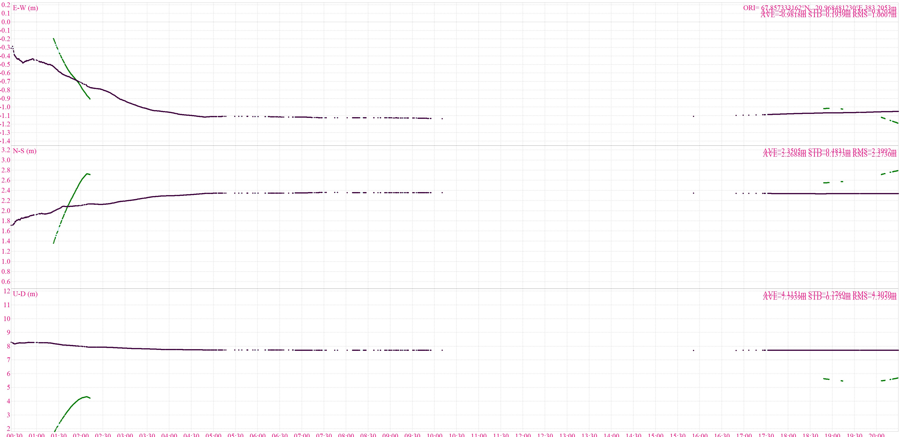

_KIRU GPS Position — broadcast (1A) vs precise (1B). Expected: 1B converges to sU ≈ 0.03 m; 1A remains near 0.10 m. Convergence is visible as a downward ramp in the U formal StdDev._

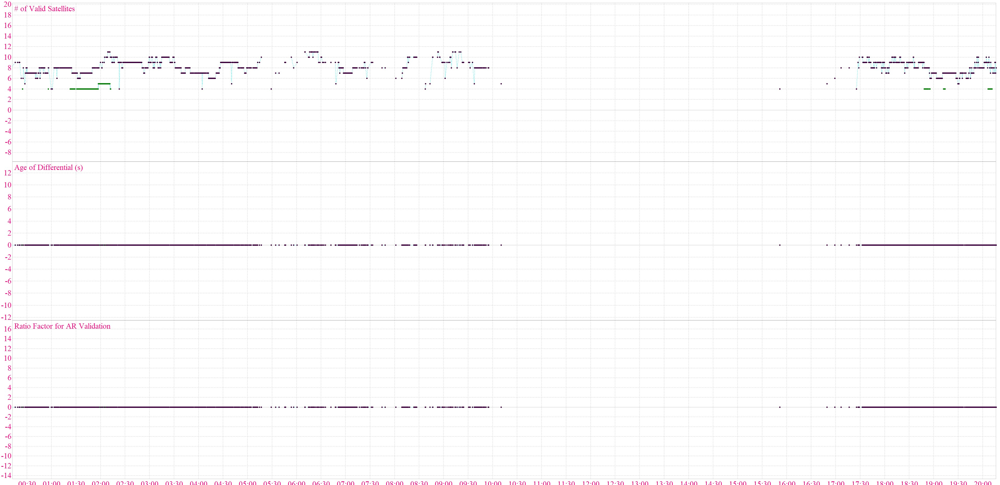

_KIRU GPS NSat — broadcast (1A) vs precise (1B). Expected: 1A has ~4 satellites (only high-SNR GPS accepted), 1B has ~9 satellites with stable tracking throughout the session._

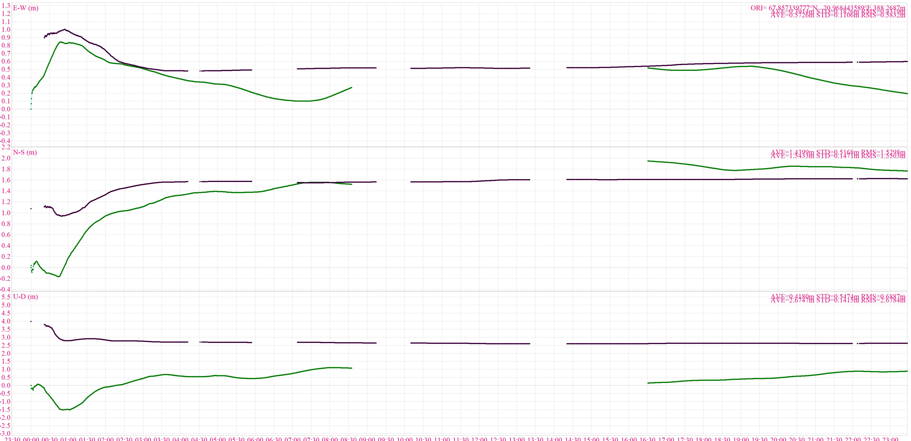

_KIRU Multi-file position view — all KIRU Exp 1 runs overlaid. This plot compares the full epoch distributions simultaneously. The gap in 1A coverage confirms that broadcast processing fails for most of the session._

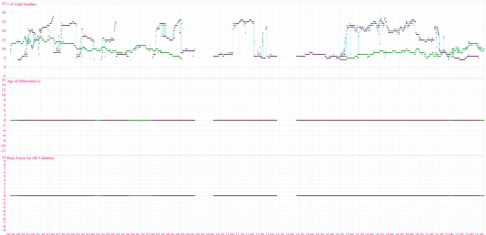

_KIRU Multi-file NSat view — confirms the satellite count contrast between broadcast and precise modes. RTKLIB-EX accepts more GPS observations in precise mode because the residual after precise clock correction is much smaller, passing quality thresholds._

### HKWS — Exp 1 Plots

**What to look for:** HKWS is GPS-optimised (22°N). 1B should show the best GPS-only result across all stations (sU = 0.013 m). Convergence takes 122 min — longer than ZIM2 (82 min) but the final precision is better. The NSat plot shows consistent 7–8 GPS satellites throughout the day.

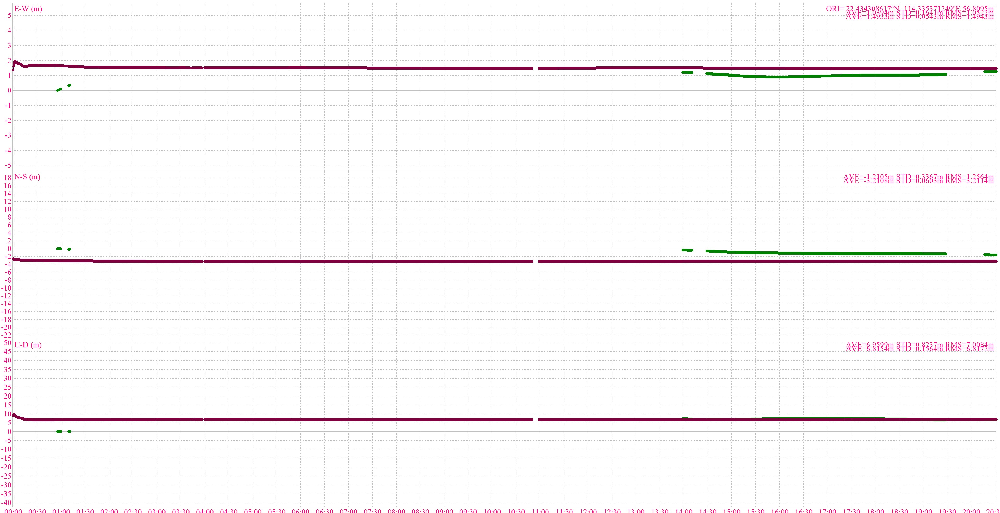

_HKWS GPS Position — broadcast (1A) vs precise (1B). Expected: 1A shows scattered, non-converged solution; 1B shows clear convergence and final sU ≈ 0.013 m — the best GPS-only result in this study._

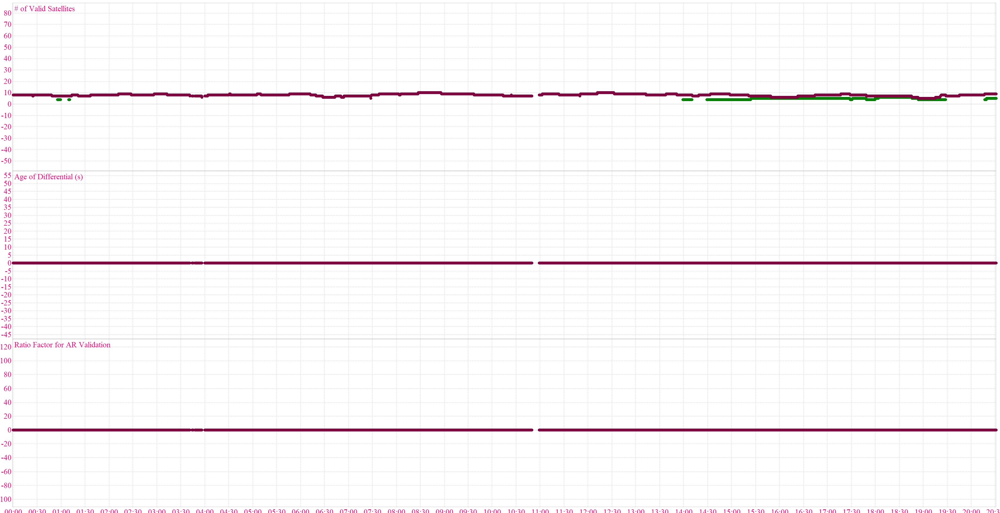

_HKWS GPS NSat — confirms near-complete daily coverage in precise mode (2847/2880 epochs = 97% of day). The tropical latitude provides continuous GPS visibility with no polar night or low-elevation gaps._

### ZIM2 — Exp 1 Plots

**What to look for:** ZIM2 converges faster than any other station (82 min) despite comparable satellite count. This is the signature of the better vertical geometry at 47°N. After convergence, sU = 0.014 m — marginally worse than HKWS but with faster convergence. The NSat plot shows 8–9 GPS satellites — higher than KIRU and WUH2 for this session window.

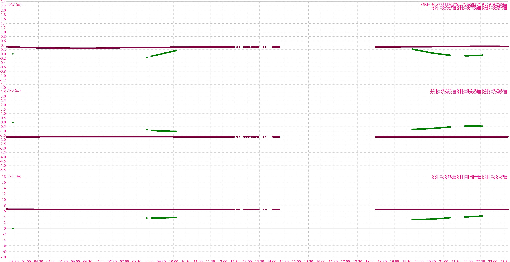

_ZIM2 GPS Position — broadcast (1A) vs precise (1B). Expected: 1A converges partially (391 valid epochs, sU = 0.085 m) because ZIM2's geometry is strong enough that even broadcast processing gives partial convergence. 1B converges to sU = 0.014 m in 82 min — fastest of all 4 stations._

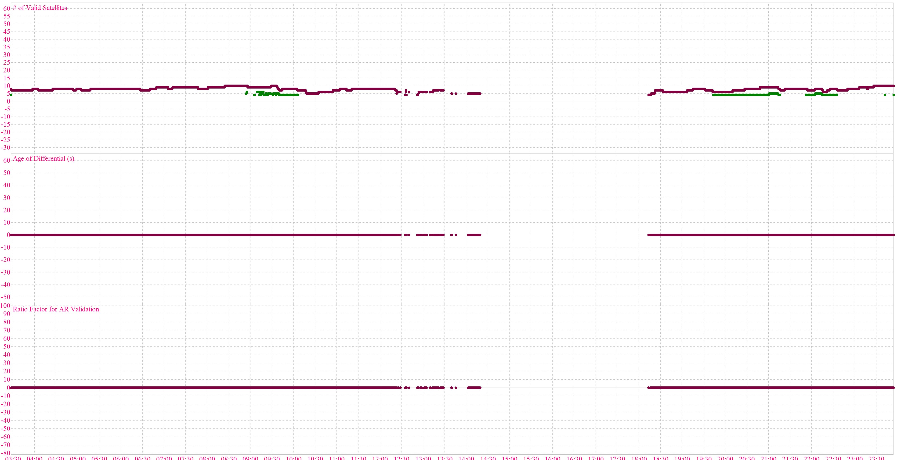

_ZIM2 GPS NSat — broadcast mode still achieves 391 valid epochs (better than KIRU's 136) because ZIM2's lower latitude and better geometry allow more epochs to pass quality checks even with broadcast products._

> **Note:** WUH2 Exp 1 plots are not available (only 76 valid epochs in 1A, insufficient for a meaningful plot).

---

## Experiment 2 — Constellation Comparison (2A / 2B / 2C / 2D)

**2A:** GPS only | **2B:** GPS+Galileo | **2C:** GPS+Galileo+BeiDou | **2D:** GPS+GLO+GAL+QZSS+BDS  
All: L1+L2, Iono-Free LC, precise products, Saastamoinen, dynamics on, 15° mask

| Station | Config  | Epochs | sN (m) | sE (m) | sU (m) | Conv (min) | Avg sats |
| ------- | ------- | ------ | ------ | ------ | ------ | ---------- | -------- |
| KIRU    | 2A GPS  | 1456   | 0.025  | 0.033  | 0.031  | 106        | 9.2      |
| KIRU    | 2B +GAL | 1530   | 0.017  | 0.023  | 0.022  | 96         | 14.4     |
| KIRU    | 2C +BDS | 1203   | 0.031  | 0.034  | 0.037  | 78         | 14.0     |
| KIRU    | 2D +ALL | 2342   | 0.016  | 0.017  | 0.021  | 101        | 6.0      |
| WUH2    | 2A GPS  | 1226   | 0.010  | 0.023  | 0.023  | 146        | 6.5      |
| WUH2    | 2B +GAL | 1288   | 0.007  | 0.017  | 0.017  | 82         | 11.8     |
| WUH2    | 2C +BDS | 1531   | 0.012  | 0.023  | 0.025  | 168        | 12.6     |
| WUH2    | 2D +ALL | 1850   | 0.009  | 0.017  | 0.018  | 142        | 13.2     |
| HKWS    | 2A GPS  | 2847   | 0.005  | 0.013  | 0.013  | 122        | 7.3      |
| HKWS    | 2B +GAL | 2880   | 0.005  | 0.012  | 0.013  | 121        | 12.6     |
| HKWS    | 2C +BDS | 1560   | 0.014  | 0.035  | 0.028  | 260        | 9.5      |
| HKWS    | 2D +ALL | 1714   | 0.011  | 0.022  | 0.022  | 125        | 12.7     |
| ZIM2    | 2A GPS  | 2272   | 0.007  | 0.015  | 0.014  | 82         | 8.5      |
| ZIM2    | 2B +GAL | 2880   | 0.006  | 0.010  | 0.010  | 63         | 14.6     |
| ZIM2    | 2C +BDS | 2345   | 0.014  | 0.024  | 0.022  | 135        | 7.3      |
| ZIM2    | 2D +ALL | 2518   | 0.010  | 0.018  | 0.016  | 74         | 9.8      |

**Expected behavior:**

2A → 2B (add Galileo): The NSat plot shows an immediate increase in tracked satellites when Galileo is added. The position plot should show tighter horizontal scatter and lower formal StdDev in 2B. Expected improvement: ~20–30% in sU. This is because Galileo E1/E5a signals are independent from GPS, providing additional geometry and averaging out multipath.

2A → 2C (add BDS): Effect depends strongly on latitude. At WUH2 (30°N) and ZIM2 (47°N), BDS adds useful satellites → more epochs and comparable precision. At HKWS (22°N), BDS adds satellites but at elevation angles that introduce more tropospheric residuals → worse precision. At KIRU (68°N), BDS MEO satellites are near or below the horizon → the added signals are noisy → valid epoch count drops from 1530 to 1203, precision worsens. This latitude dependency is the key finding.

2A → 2D (all constellations): Adding GLONASS and QZSS fills in the satellite count gaps. For KIRU, GLONASS (Russian polar orbit) provides significant benefit at high latitude → 2342 valid epochs vs 1530 for GPS+GAL alone. For WUH2 and ZIM2, 2D improves epoch count but precision is slightly worse than 2B (more parameters to estimate, higher chance of biases from different signal quality).

**Finding:** GPS+Galileo (2B) is the optimal configuration for all 4 stations in terms of precision. ZIM2 achieves the overall best result of this entire study: sU = 0.010 m with 63 min convergence in Exp 2B.

### KIRU — Exp 2 Plots

**What to look for in 2A vs 2B:** NSat plot: ~9 satellites (GPS only) rising to ~14 (GPS+GAL). Position plot: position scatter tighter in 2B, U formal StdDev lower. Convergence time drops from 106 to 96 min.

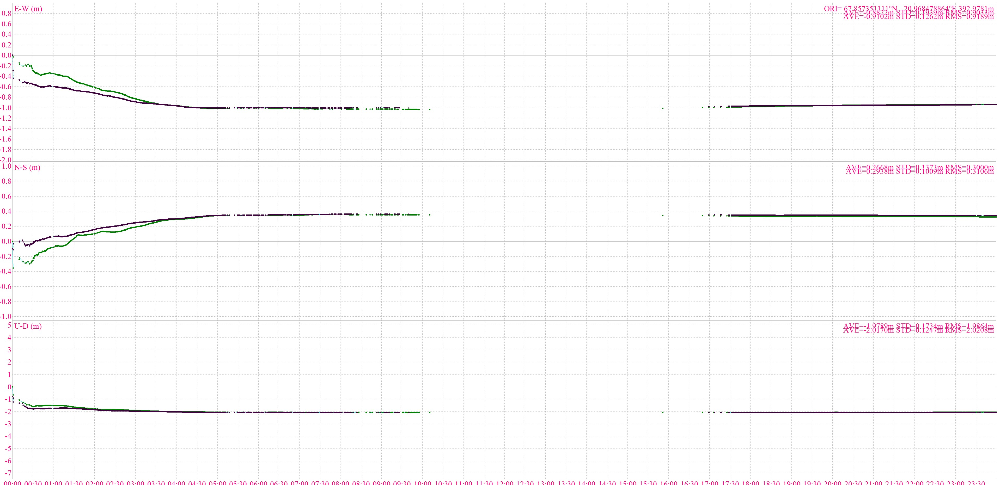

_KIRU Position GPS (2A) vs GPS+Galileo (2B). Expected: 2B shows tighter scatter and faster convergence. sU improves from 0.031 to 0.022 m — a 29% improvement from Galileo addition._

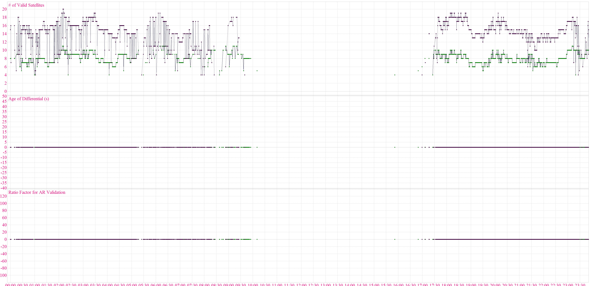

_KIRU NSat GPS (2A) vs GPS+Galileo (2B). Expected: satellite count rises from ~9 to ~14 when Galileo is enabled. The additional orange/yellow bars represent Galileo E1/E5a observations._

**What to look for in 2A vs 2C:** The NSat plot should show BDS satellites are mostly absent at KIRU (low elevation → rejected at 15° mask). Despite nominally adding BDS, the valid epoch count drops (1203 < 1530), and precision is worse. This is expected — low-elevation satellites introduce more tropospheric and ionospheric errors.

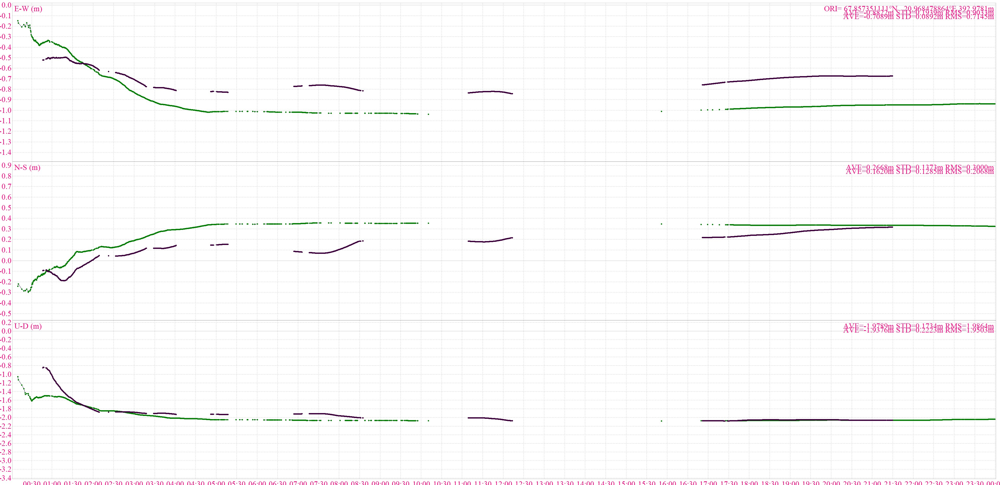

_KIRU Position GPS (2A) vs GPS+Galileo+BDS (2C). Expected: 2C is WORSE than 2A — fewer valid epochs (1203 vs 1456), higher sU (0.037 vs 0.031 m). The BDS addition at 68°N degrades results because BDS MEO satellites are near the horizon and the associated errors outweigh the extra geometry._

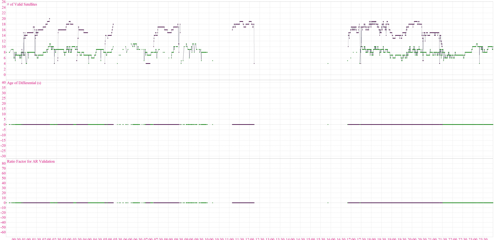

_KIRU NSat GPS (2A) vs GPS+Galileo+BDS (2C). Expected: very few or no BDS satellite observations visible — BDS MEO is below the 15° elevation mask at 68°N for most of the day. This directly confirms why BDS adds no benefit for KIRU._

**What to look for in 2A vs 2D:** GLONASS satellites (R-PRN) orbit at ~64.8° inclination — they ARE visible at 68°N latitude. Adding GLONASS in 2D provides genuinely useful satellites → 2342 valid epochs vs 1456 for GPS alone. This is the one case where adding a constellation beyond GPS+GAL helps KIRU.

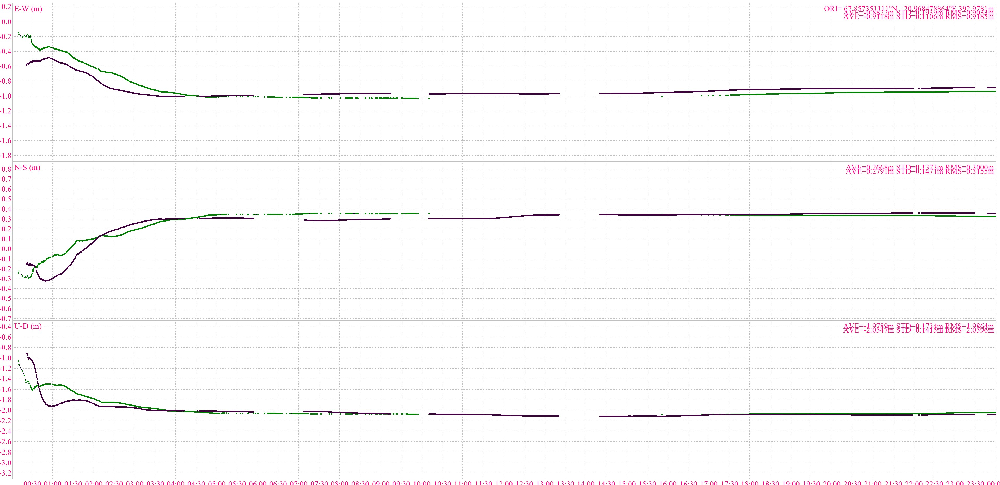

_KIRU Position GPS (2A) vs all constellations (2D). Expected: 2D shows more valid epochs (2342 vs 1456) and slight precision improvement (sU 0.021 vs 0.031 m). The improvement comes from GLONASS, which has good high-latitude coverage due to its 64.8° orbital inclination — designed for Russian high-latitude coverage._

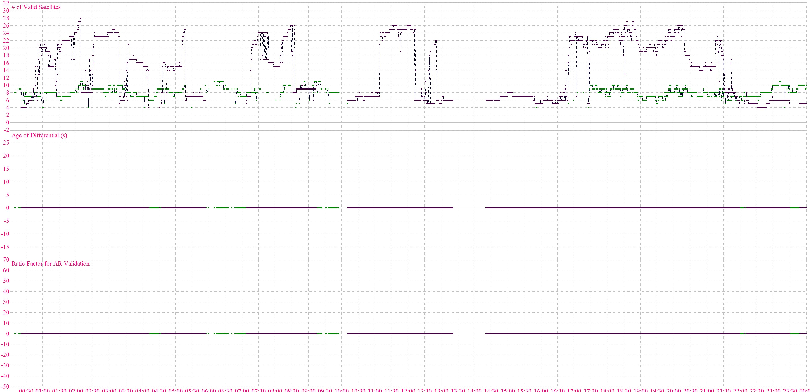

_KIRU NSat GPS (2A) vs all constellations (2D). Expected: significant increase in satellite count from the GLONASS constellation (shown in different colour). GLONASS passes are regular and numerous at 68°N._

### WUH2 — Exp 2 Plots

**What to look for:** WUH2 at 30°N is in BDS's primary service region. Expect 2C (add BDS) to add more usable satellites than at KIRU. However, BDS in 2C still doesn't beat GPS+GAL (2B) in precision — BDS code biases and clock offsets are less well-modelled than GPS. Epoch count does improve significantly for 2C vs KIRU.

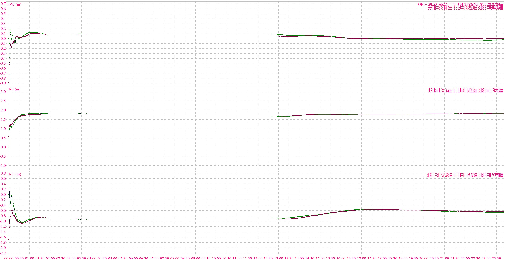

_WUH2 Position GPS (2A) vs GPS+Galileo (2B). Expected: clear improvement — sU drops from 0.023 to 0.017 m (26%), convergence from 146 to 82 min. Galileo adds well-calibrated signals that complement GPS at 30°N._

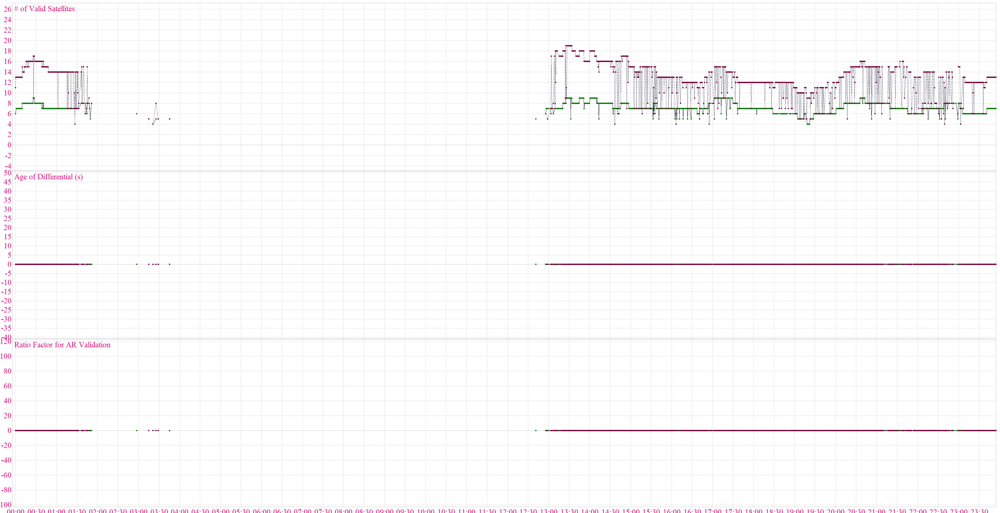

_WUH2 NSat GPS (2A) vs GPS+Galileo (2B). Expected: satellite count increase from ~7 to ~12 when Galileo is added. Both GPS and Galileo have good mid-latitude coverage at 30°N._

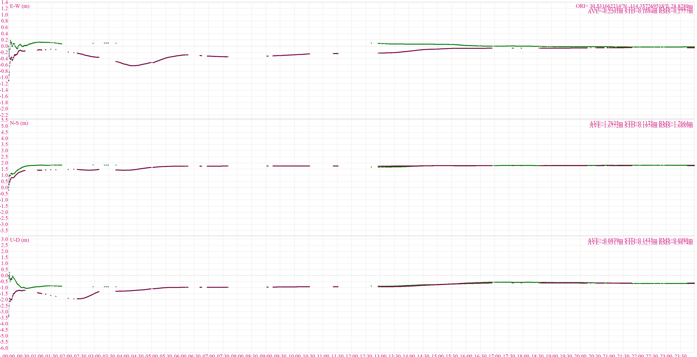

_WUH2 Position GPS (2A) vs GPS+Galileo+BDS (2C). Expected: more epochs (1531 vs 1226) because BDS IS visible at 30°N, but precision is slightly worse (sU 0.025 vs 0.023 m). BDS adds observations but also adds parameter estimation overhead. Note: this is different from KIRU where BDS reduced epochs — at WUH2, BDS is genuinely visible and usable but not enough to beat GPS+GAL precision._

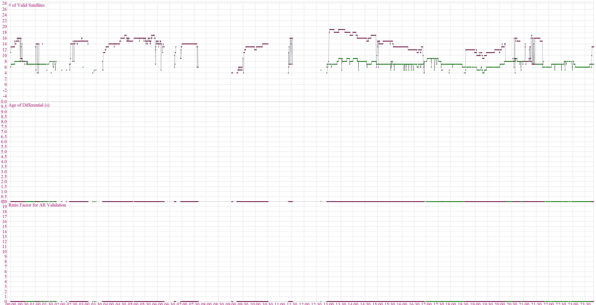

_WUH2 NSat GPS (2A) vs GPS+Galileo+BDS (2C). Expected: visible BDS satellite observations (in contrast to KIRU). Multiple BDS MEO and IGSO satellites pass at useful elevation angles for Wuhan's longitude._

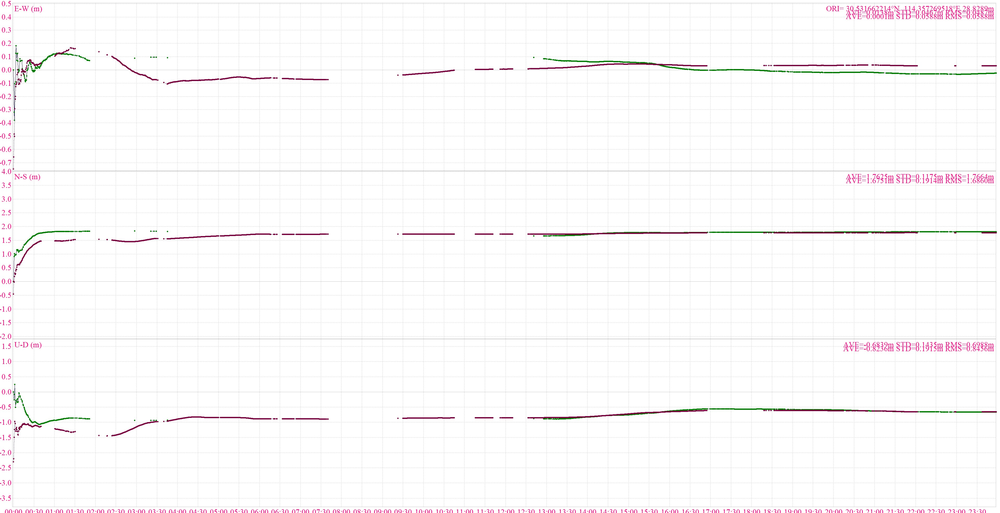

_WUH2 Position GPS (2A) vs all constellations (2D). Expected: highest epoch count (1850), good precision (sU 0.018 m). Adding GLONASS and QZSS at 30°N fills remaining gaps. Still not as good as 2B precision-wise — full constellation means more parameters, larger system, slight precision dilution._

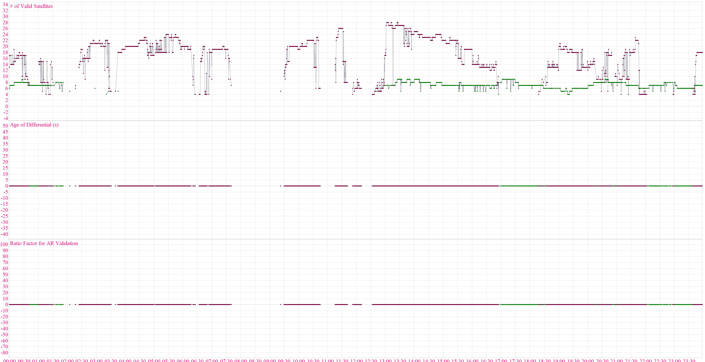

_WUH2 NSat GPS (2A) vs all constellations (2D). Expected: highest satellite count of any WUH2 configuration. Each constellation adds a distinct colour band in the NSat plot._

### HKWS — Exp 2 Plots

**What to look for:** HKWS already achieves maximum GPS coverage (2847 epochs in 2A). Adding Galileo (2B) provides marginal improvement because GPS is already nearly optimal. Adding BDS (2C) degrades precision — HK urban environment may introduce more BDS multipath, and IGSO satellites at near-constant elevation cause correlated tropospheric residuals.

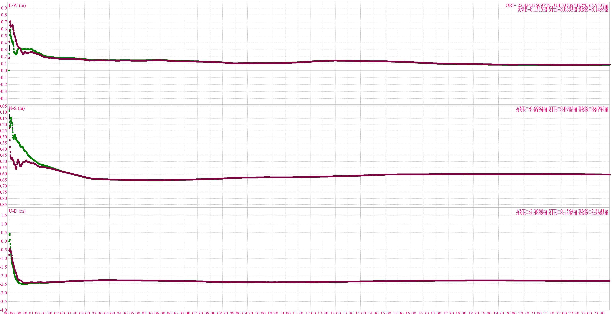

_HKWS Position GPS (2A) vs GPS+Galileo (2B). Expected: marginal improvement — sU stays at 0.013 m, epoch count goes to the maximum 2880 (full 24h). At 22°N, GPS already covers the sky well; Galileo adds satellites but provides diminishing returns._

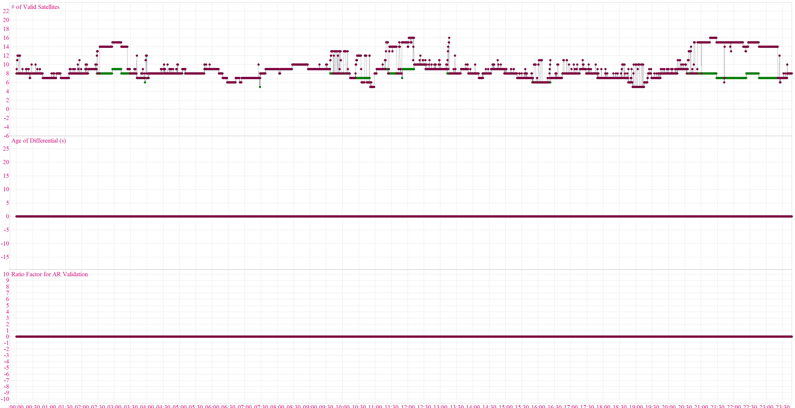

_HKWS NSat GPS (2A) vs GPS+Galileo (2B). Expected: satellite count increases from ~7 to ~13. HKWS reaches maximum epochs (2880 = 24h at 30s) in 2B._

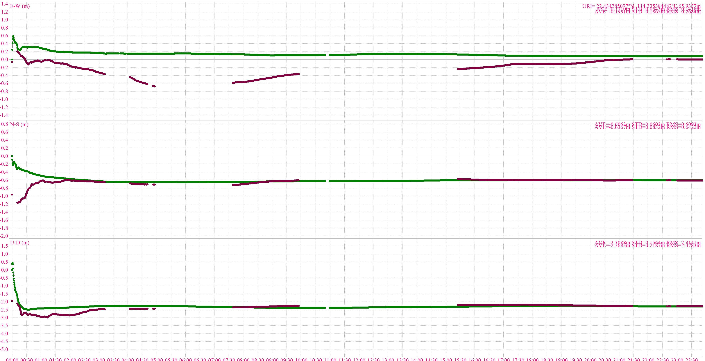

_HKWS Position GPS (2A) vs GPS+Galileo+BDS (2C). Expected: DEGRADED — sU worsens from 0.013 to 0.028 m (2×), epochs drop from 2847 to 1560, convergence time doubles to 260 min. At 22°N, BDS GEO and IGSO satellites are nearly stationary in the sky — their tropospheric delays are highly correlated, leading to estimation instability. This is a known characteristic of BDS GEO satellites in PPP._

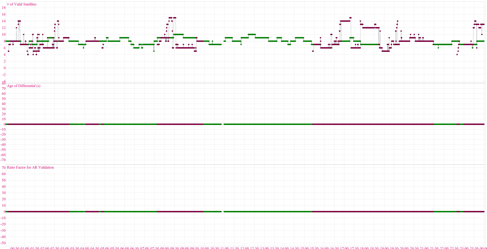

_HKWS NSat GPS (2A) vs GPS+Galileo+BDS (2C). Expected: BDS satellites visible at 22°N but the epoch count drops significantly — many BDS-contaminated epochs are rejected by RTKLIB's quality checks because BDS GEO signals at low elevation angles have high noise._

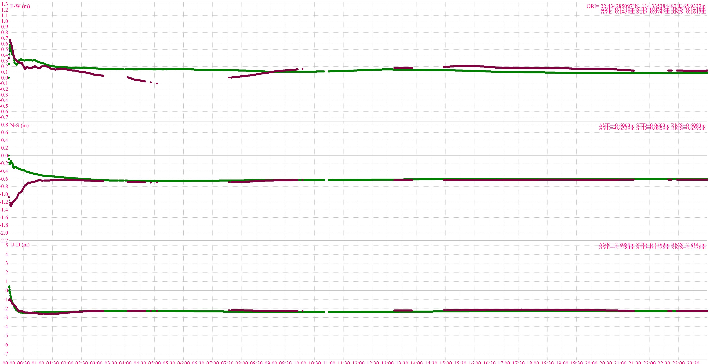

_HKWS Position GPS (2A) vs all constellations (2D). Expected: better than 2C (more constellations dilute the BDS bias effect) but still worse than 2B. sU = 0.022 m — 70% worse than GPS+GAL-only._

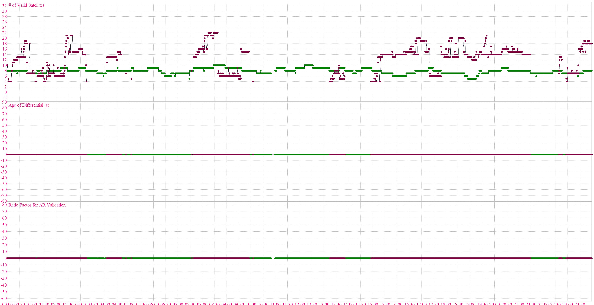

_HKWS NSat GPS (2A) vs all constellations (2D). Expected: highest satellite count across all HKWS experiments (~13 satellites). GLONASS adds further observations for a complete multi-GNSS solution._

### ZIM2 — Exp 2 Plots

**What to look for:** ZIM2 achieves the best result of the entire study in 2B: sU = 0.010 m, convergence in 63 min. The 2A vs 2B comparison shows the clearest improvement. The 2B NSat plot shows 14.6 average satellites — excellent redundancy. The 2C and 2D results are worse than 2B, showing the optimal is GPS+Galileo.

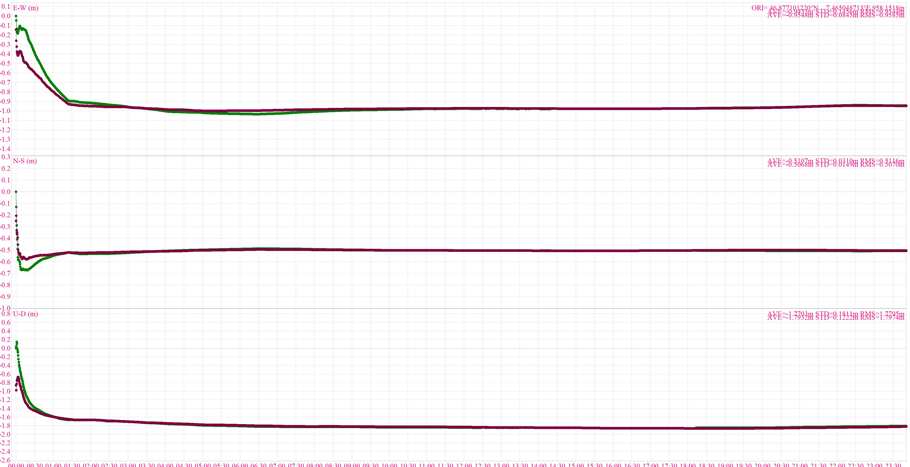

_ZIM2 Position GPS (2A) vs GPS+Galileo (2B). This is the best result in the entire study. Expected: clear convergence by 63 min, final sU = 0.010 m. The 2B plot should show a tight cluster in horizontal scatter and very low formal StdDev bars. The improvement from adding Galileo is larger here than at any other station (0.014 → 0.010 m, 29%) because ZIM2's geometry is already good and Galileo fills the remaining gaps._

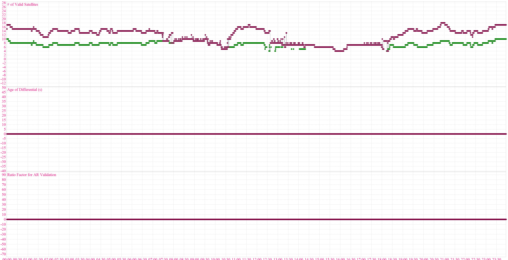

_ZIM2 NSat GPS (2A) vs GPS+Galileo (2B). Expected: satellite count rises from ~9 to ~15. At 47°N, both GPS and Galileo have consistent, high-elevation coverage, producing a stable plateau of 14–16 satellites in 2B throughout most of the day._

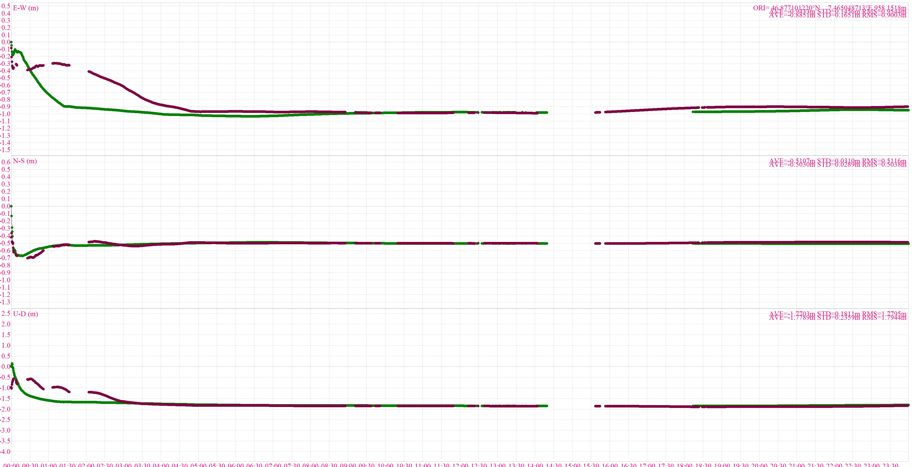

_ZIM2 Position GPS (2A) vs GPS+Galileo+BDS (2C). Expected: adding BDS degrades ZIM2 from sU = 0.014 m to 0.022 m. At 47°N, BDS MEO satellites are visible but at lower elevation than GPS/Galileo — they introduce more tropospheric residuals. This confirms GPS+Galileo is the optimal configuration._

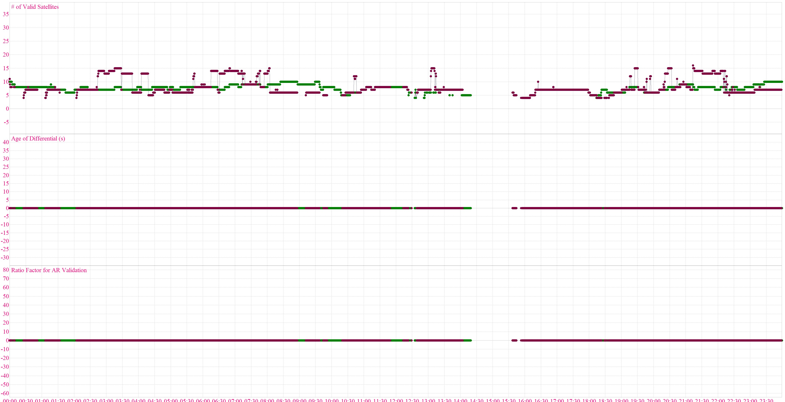

_ZIM2 NSat GPS (2A) vs GPS+Galileo+BDS (2C). Expected: BDS satellites visible (in contrast to KIRU) but epoch count drops slightly (2345 vs 2272 for GPS) due to BDS-related quality rejections in some arcs._

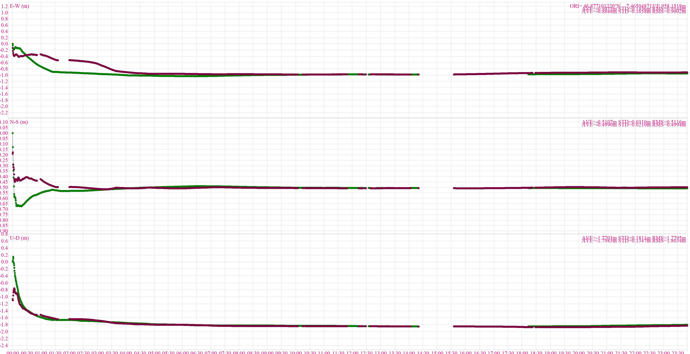

_ZIM2 Position GPS (2A) vs all constellations (2D). Expected: high epoch count (2518) and good precision (sU = 0.016 m). Better than 2C because GLONASS and QZSS improve geometry without the BDS GEO instability problem. Still not as good as GPS+Galileo (2B)._

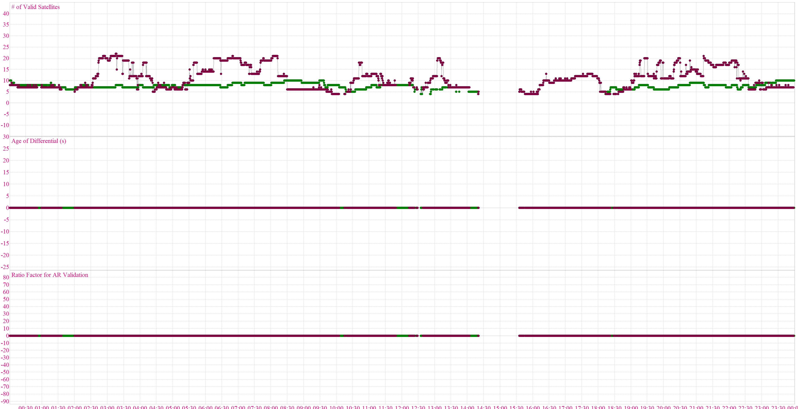

_ZIM2 NSat GPS (2A) vs all constellations (2D). Expected: highest epoch count (2518) reflecting complete sky coverage when all constellations are enabled. GLONASS at 47°N provides good coverage supplementing GPS+Galileo._

---

## Experiment 3 — Float PPP vs PPP-AR

**Config 3A:** GPS+Galileo+BDS, dual-freq IF, float ambiguities (AR=OFF)  
**Config 3B:** same, AR=ON (PPP Ambiguity Resolution with IGS OSB biases)

| Station | Exp | Epochs | sN (m) | sE (m) | sU (m) | Conv (min) | AR fixed% |
| ------- | --- | ------ | ------ | ------ | ------ | ---------- | --------- |
| KIRU    | 3A  | 1203   | 0.031  | 0.034  | 0.037  | 78         | 0%        |
| KIRU    | 3B  | 1200   | 0.031  | 0.034  | 0.037  | 78         | 0%        |
| WUH2    | 3A  | 1531   | 0.012  | 0.023  | 0.025  | 168        | 0%        |
| WUH2    | 3B  | 1497   | 0.013  | 0.023  | 0.025  | 167        | 0%        |
| HKWS    | 3A  | 1560   | 0.014  | 0.035  | 0.028  | 260        | 0%        |
| HKWS    | 3B  | 1566   | 0.014  | 0.035  | 0.028  | 257        | 0%        |
| ZIM2    | 3A  | 2345   | 0.014  | 0.024  | 0.022  | 135        | 0%        |
| ZIM2    | 3B  | 2376   | 0.014  | 0.024  | 0.022  | 142        | 0%        |

**Expected behavior:** The 3A and 3B plots should be IDENTICAL (or nearly so). This is the expected outcome. RTKLIB-EX 2.5.0 implements PPP-AR using the FCB (Fractional Cycle Bias) or IRC (Integer Recovery Clock) product format. IGS now distributes OSB (Observable-Specific Bias) format, which RTKLIB-EX does not correctly use for integer ambiguity fixing. The AR ratio stays at 0.0 in all 3B runs — no integer fixing occurs. The overlaid plots confirm this: 3A ≡ 3B.

This is not a failure in the experiment — it is a finding: **RTKLIB-EX 2.5.0 cannot fix integer ambiguities with current IGS bias products.** For true PPP-AR, PRIDE-PPP-AR (which natively handles OSB-format biases) is required.

### KIRU — Exp 3 Plots

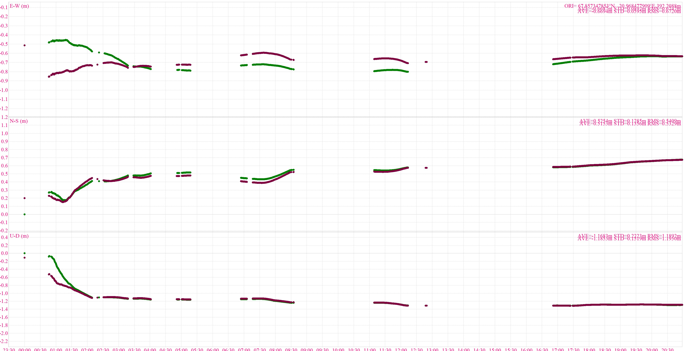

_KIRU Exp 3 Position — float PPP (3A) overlaid with PPP-AR attempt (3B). Expected: the two traces are indistinguishable. The AR ratio column remains 0.0 throughout, confirming no ambiguity fixing. sU = 0.037 m for both._

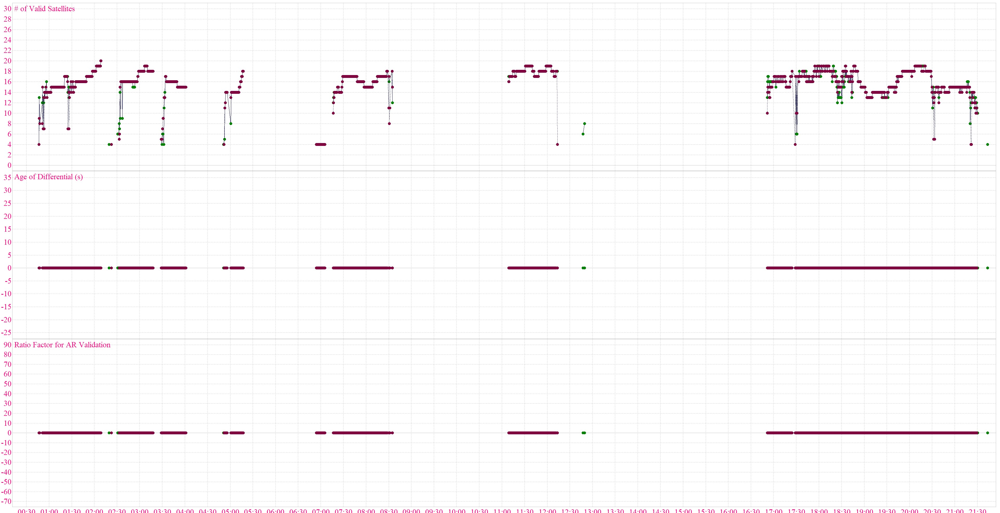

_KIRU Exp 3 NSat — GPS+Galileo+BDS configuration (same for 3A and 3B). Expected: ~14 satellites on average, with BDS contributing few observations at 68°N._

### WUH2 — Exp 3 Plots

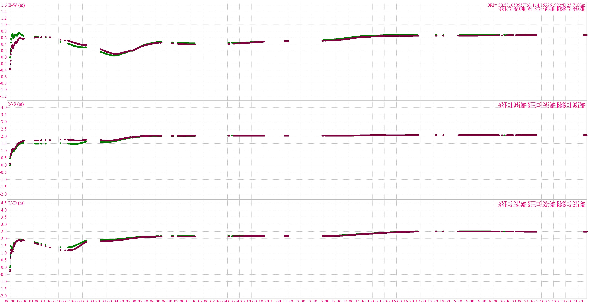

_WUH2 Exp 3 Position — float PPP (3A) vs PPP-AR attempt (3B). Expected: identical results, sU = 0.025 m. The lack of AR improvement is consistent across all stations — this is a software limitation, not a data quality issue._

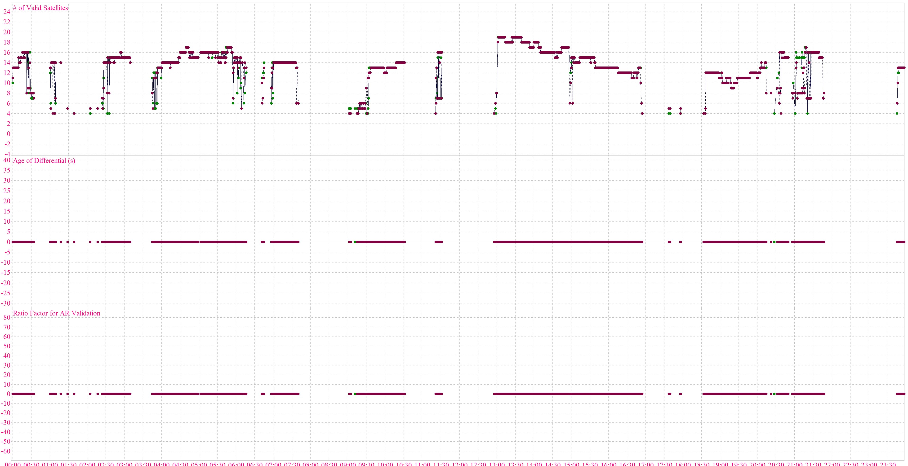

_WUH2 Exp 3 NSat — GPS+Galileo+BDS at 30°N. Expected: ~12–13 satellites with meaningful BDS contributions visible at Wuhan's latitude._

### HKWS — Exp 3 Plots

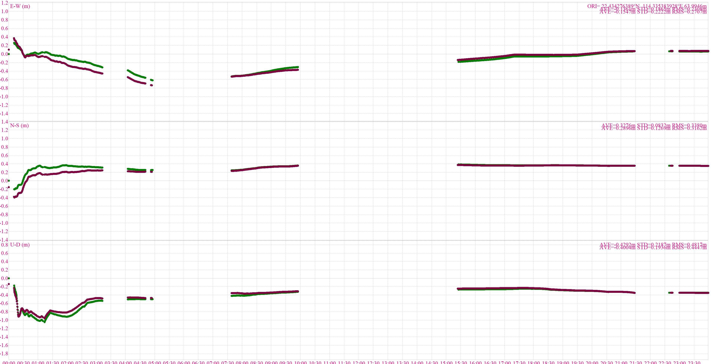

_HKWS Exp 3 Position — float PPP (3A) vs PPP-AR attempt (3B). Expected: identical. Note that HKWS 3A/3B (GPS+Galileo+BDS) shows worse precision than HKWS 2B (GPS+Galileo only), confirming the BDS degradation at 22°N observed in Exp 2._

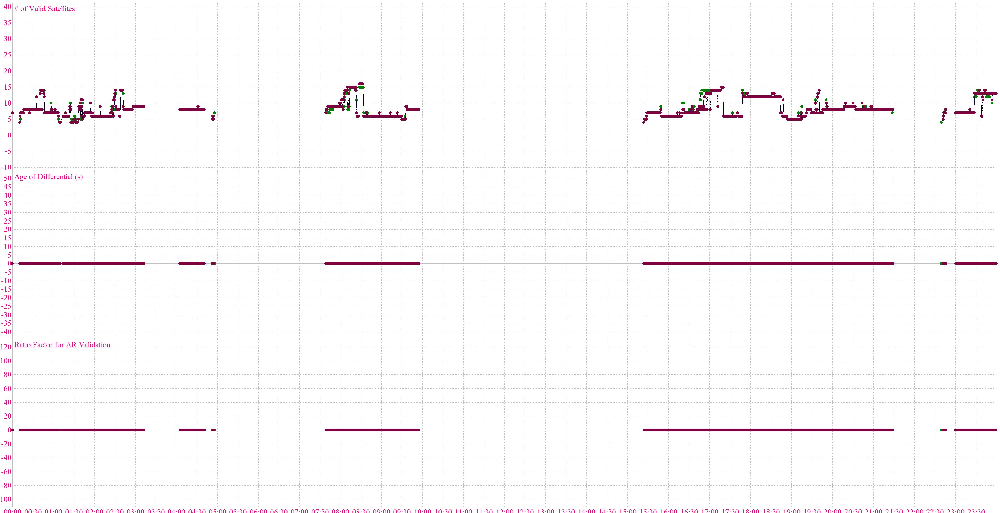

_HKWS Exp 3 NSat — GPS+Galileo+BDS at 22°N. BDS satellites are visible but some are GEO (nearly stationary in sky) and cause the quality degradation visible in Exp 2C/3._

### ZIM2 — Exp 3 Plots

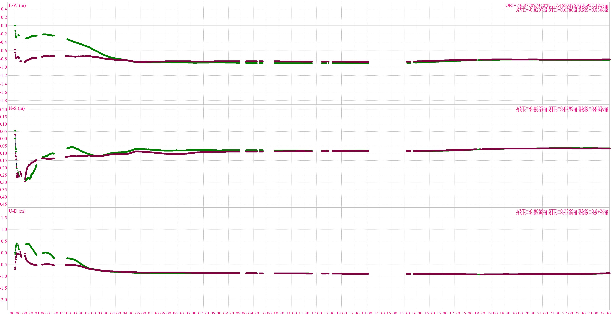

_ZIM2 Exp 3 Position — float PPP (3A) vs PPP-AR attempt (3B). Expected: identical, sU = 0.022 m. ZIM2 shows the highest epoch count in Exp 3 (2345/2376) due to its superior geometry even with the GPS+GAL+BDS constellation._

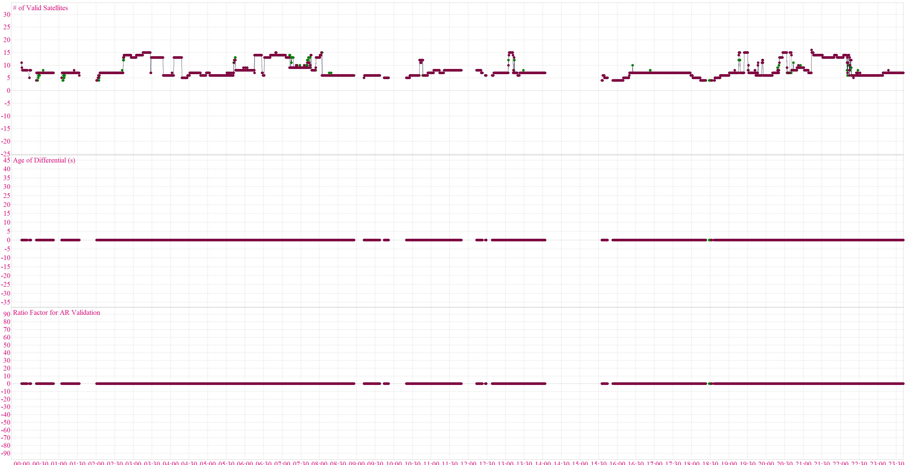

_ZIM2 Exp 3 NSat — GPS+Galileo+BDS at 47°N. Expected: ~14 satellites average, with BDS contributing some observations but fewer than at lower-latitude stations._

---

## Experiment 4 — Ionosphere Correction Method (4A / 4B / 4C)

**4A:** L1-only, GPS, Klobuchar broadcast iono | **4B:** L1+L2, GPS+GAL+BDS, Iono-Free LC | **4C:** L1-only, GPS, IONEX TEC map

| Station | 4A sU (m) | 4B sU (m) | 4C sU (m) | 4A→4B gain | 4A→4C gain |
| ------- | --------- | --------- | --------- | ---------- | ---------- |
| KIRU    | 0.104     | 0.037     | 0.087     | 2.8×       | 1.2×       |
| WUH2    | 0.108     | 0.025     | 0.090     | 4.3×       | 1.2×       |
| HKWS    | 0.115     | 0.028     | 0.089     | 4.1×       | 1.3×       |
| ZIM2    | 0.090     | 0.022     | 0.074     | 4.1×       | 1.2×       |

| Station | Config          | Epochs | sN (m) | sE (m) | sU (m) | Conv (min) |
| ------- | --------------- | ------ | ------ | ------ | ------ | ---------- |
| KIRU    | 4A Klobuchar    | 2146   | 0.045  | 0.039  | 0.104  | N/C        |
| KIRU    | 4B dual-freq IF | 1203   | 0.031  | 0.034  | 0.037  | 78         |
| KIRU    | 4C IONEX        | 2340   | 0.038  | 0.033  | 0.087  | 724        |
| WUH2    | 4A Klobuchar    | 1796   | 0.045  | 0.045  | 0.108  | N/C        |
| WUH2    | 4B dual-freq IF | 1531   | 0.012  | 0.023  | 0.025  | 168        |
| WUH2    | 4C IONEX        | 1639   | 0.038  | 0.037  | 0.090  | 586        |
| HKWS    | 4A Klobuchar    | 1722   | 0.044  | 0.049  | 0.115  | N/C        |
| HKWS    | 4B dual-freq IF | 1560   | 0.014  | 0.035  | 0.028  | 260        |
| HKWS    | 4C IONEX        | 1986   | 0.034  | 0.038  | 0.089  | 738        |
| ZIM2    | 4A Klobuchar    | 1769   | 0.048  | 0.042  | 0.090  | 678        |
| ZIM2    | 4B dual-freq IF | 2345   | 0.014  | 0.024  | 0.022  | 135        |
| ZIM2    | 4C IONEX        | 1941   | 0.039  | 0.034  | 0.074  | 618        |

**Expected behavior:**

4A (Klobuchar L1): The position time series shows a slow, systematic drift in the U component throughout the session — never fully converging. Klobuchar corrects ~50% of ionospheric delay; the remaining 50% acts as a range bias that changes with ionospheric conditions. Convergence may not occur at all (N/C) — 4A for KIRU, WUH2, and HKWS shows sU ≥ 0.10 m at session end.

4C (IONEX TEC map): Similar pattern to 4A but with smaller amplitude. IONEX corrects ~90% of ionospheric delay (vs 50% for Klobuchar), so the residual is smaller but still present. Convergence eventually occurs (after 600–740 min for most stations!) because the residual ionospheric error is smaller and the Kalman filter can absorb it over time. The very long convergence time (~10h) is expected — this is single-frequency PPP in the presence of residual iono.

4B (dual-freq IF): Best result — the ionosphere is eliminated to first order. No systematic drift visible; clean convergence in 1–3h depending on station.

KIRU gains less from 4A→4B (2.8× vs 4× for others): KIRU at 68°N has lower absolute ionospheric TEC (high-latitude ionosphere is less dense), so the broadcast iono error is smaller there. The relative improvement is less dramatic.

### KIRU — Exp 4 Plots

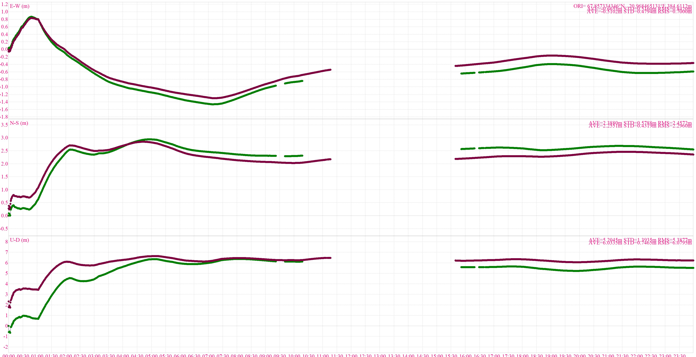

_KIRU Position — Klobuchar (4A) vs IONEX (4C). Expected: 4A shows near-constant sU ≈ 0.10 m without convergence; 4C shows slow improvement reaching sU = 0.087 m after 724 min. Both are L1-only and show the characteristic iono-residual drift pattern._

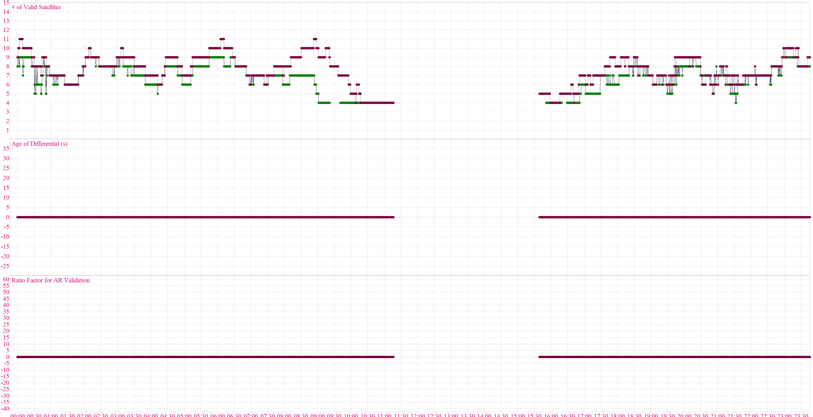

_KIRU NSat — Klobuchar (4A) vs IONEX (4C). Expected: higher epoch count in both (single-freq L1 accepts more epochs) vs dual-freq. 4A: 2146 epochs, 4C: 2340 epochs — both higher than 4B's 1203, because L1-only processing doesn't require L2 signal presence._

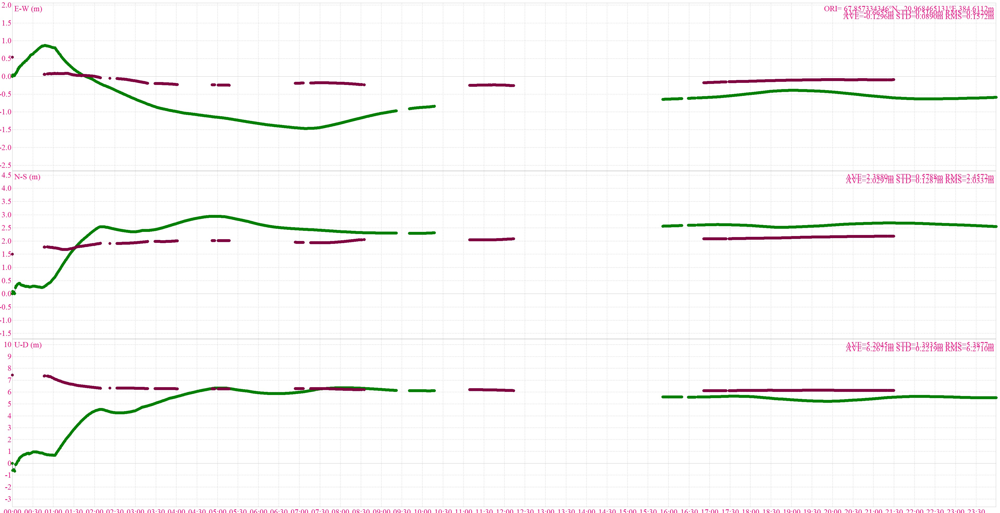

_KIRU Position — Klobuchar (4A) vs dual-frequency IF (4B). The contrast shows the fundamental advantage of dual-freq PPP. 4B achieves sU = 0.037 m with convergence in 78 min; 4A never achieves this quality in 24h._

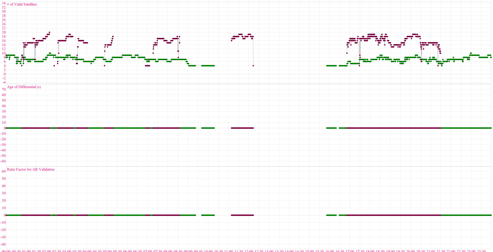

_KIRU NSat — Klobuchar (4A) vs dual-frequency IF (4B). 4A uses GPS L1 only; 4B uses GPS+GAL+BDS dual-frequency. Satellite count is higher in 4A (L1 more epochs accepted) but quality is lower._

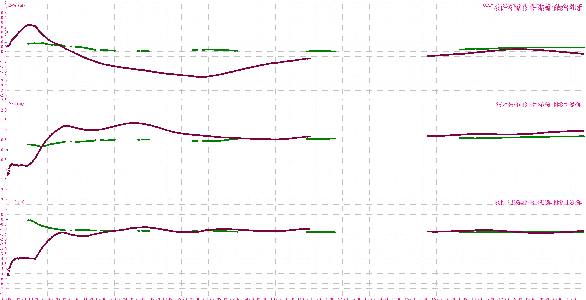

_KIRU Position — IONEX (4C) vs dual-frequency IF (4B). Clearest demonstration: IONEX reaches sU = 0.087 m after 12h; dual-freq reaches sU = 0.037 m after 1.3h. The gain from L1+L2 over IONEX is 2.4× in precision and 9× in convergence speed._

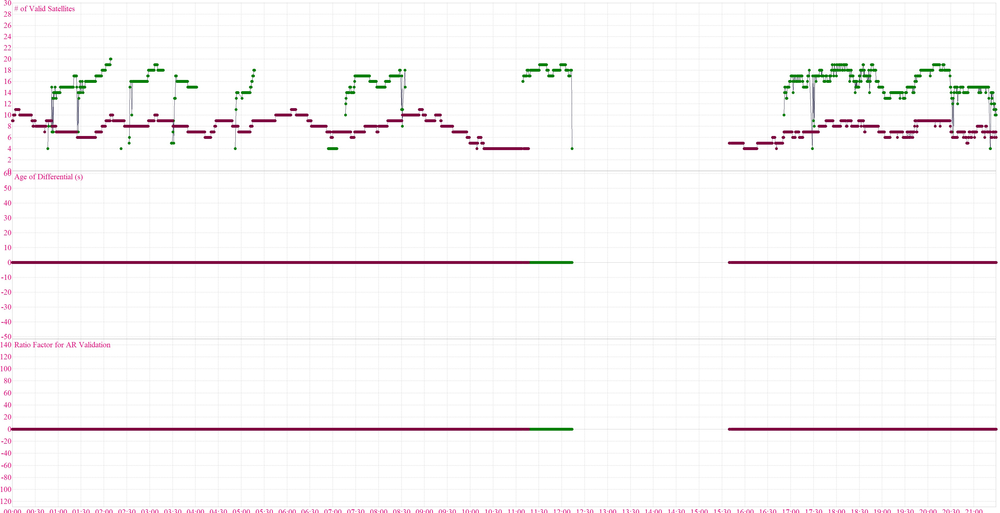

_KIRU NSat — IONEX (4C) vs dual-frequency IF (4B). 4C: GPS L1 only, 2340 epochs. 4B: multi-constellation dual-freq, 1203 epochs. Despite fewer epochs, 4B produces far better accuracy._

### WUH2 — Exp 4 Plots

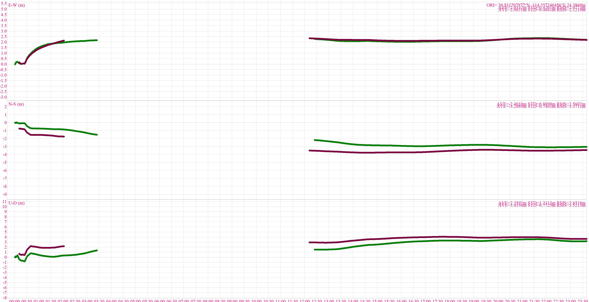

_WUH2 Position — Klobuchar (4A) vs IONEX (4C). Expected: WUH2 at 30°N has higher ionospheric TEC than KIRU → larger iono errors in 4A (0.108 m vs KIRU's 0.104 m). IONEX improves to 0.090 m. The slow drift in U component is more pronounced at mid-latitude._

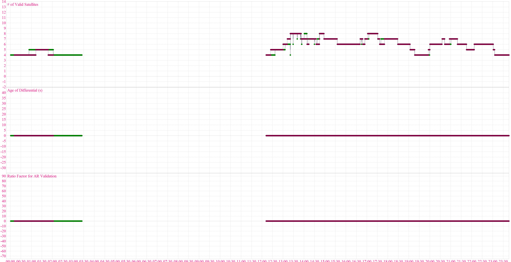

_WUH2 NSat — Klobuchar (4A) vs IONEX (4C). Expected: similar epoch counts in both single-freq modes. WUH2 has fewer GPS satellites above horizon in this session → fewer epochs than HKWS._

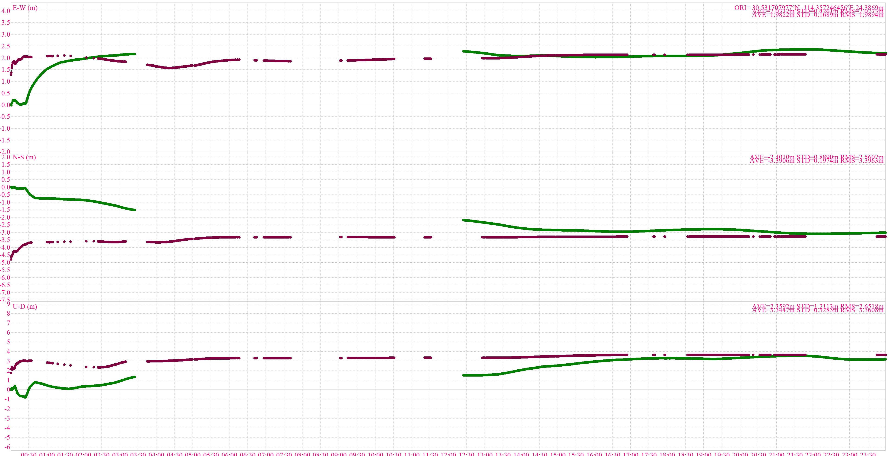

_WUH2 Position — Klobuchar (4A) vs dual-freq IF (4B). WUH2 shows the largest gain: 4.3× improvement (0.108 → 0.025 m). The convergence in 4B takes 168 min because WUH2 has fewer GPS satellites; but the final precision is excellent._

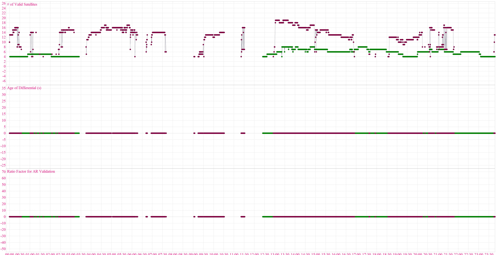

_WUH2 NSat — Klobuchar (4A) vs dual-freq IF (4B). The multi-constellation 4B adds GPS+GAL+BDS, providing more satellites than 4A's GPS-only L1._

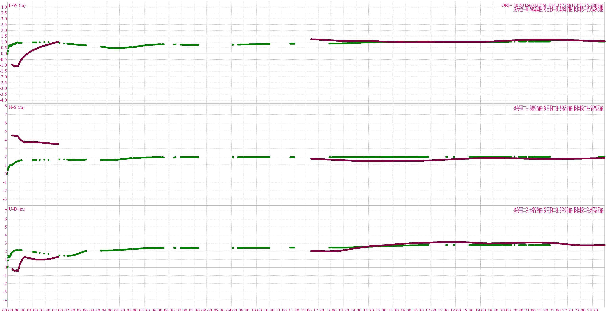

_WUH2 Position — IONEX (4C) vs dual-freq IF (4B). IONEX achieves convergence after 586 min (vs 168 min for dual-freq). Both eventually reach similar epoch counts but 4B is dramatically faster and more precise._

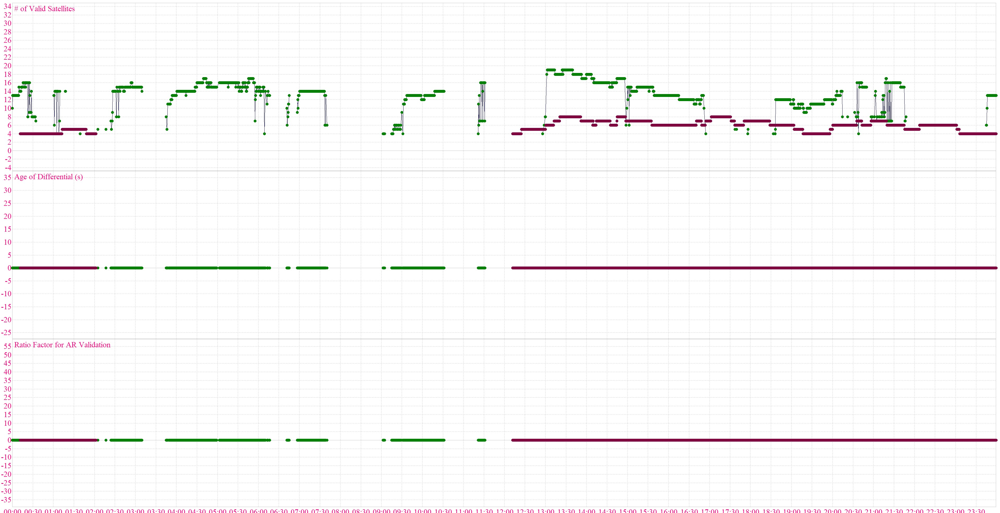

_WUH2 NSat — IONEX (4C) vs dual-freq IF (4B). Satellite count patterns reflect the difference between GPS-only and multi-constellation processing._

### HKWS — Exp 4 Plots

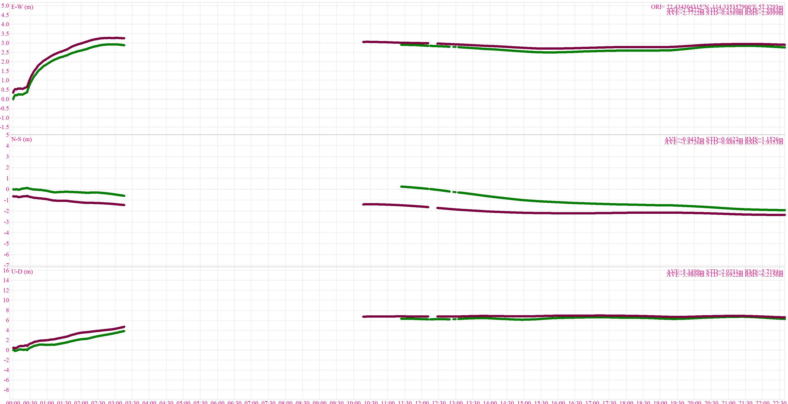

_HKWS Position — Klobuchar (4A) vs IONEX (4C). HKWS at 22°N has the highest ionospheric TEC → highest iono error (4A: sU = 0.115 m). IONEX reduces this to 0.089 m. The iono signature is most visible here as a systematic slow variation in U._

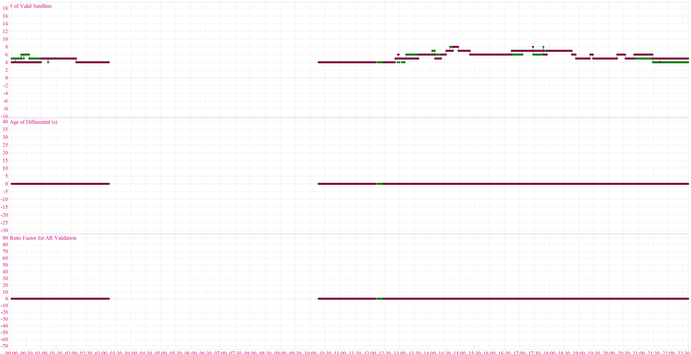

_HKWS NSat — Klobuchar (4A) vs IONEX (4C). HKWS L1 modes have good epoch counts (1722 and 1986) reflecting the tropical GPS advantage._

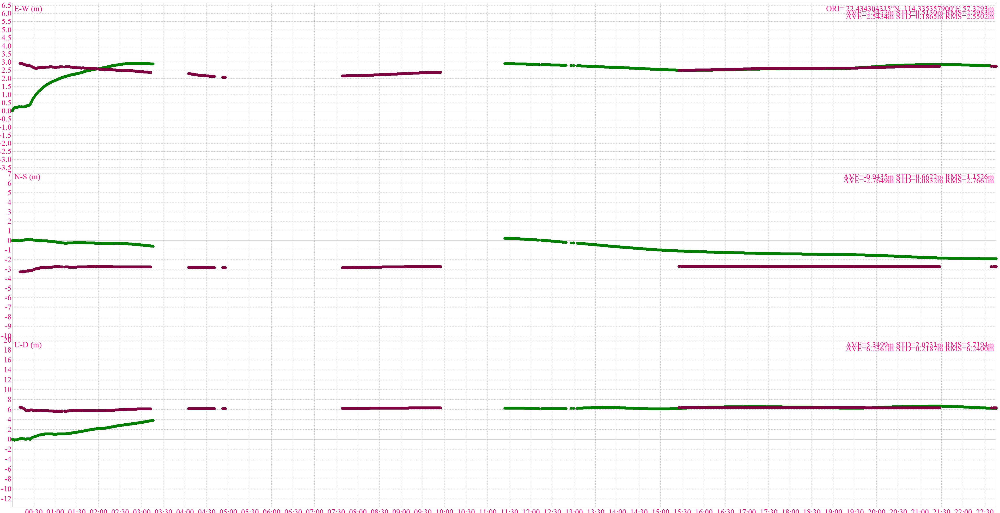

_HKWS Position — Klobuchar (4A) vs dual-freq IF (4B). The 4B result (0.028 m sU, 260 min convergence) is better than 4A but slower convergence than ZIM2. HKWS needs more time because the GPS+GAL+BDS combination includes BDS degradation at 22°N._

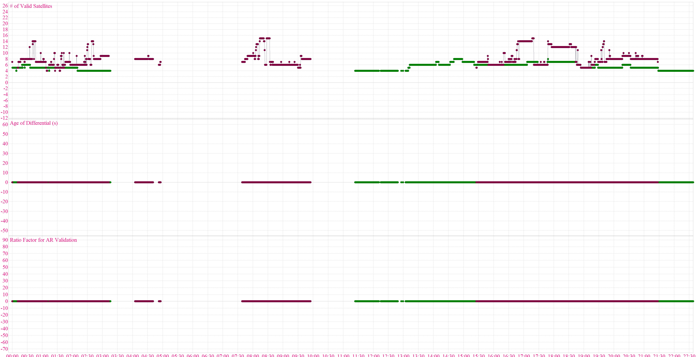

_HKWS NSat — Klobuchar (4A) vs dual-freq IF (4B). Similar to WUH2, the multi-constellation 4B shows more satellite types._

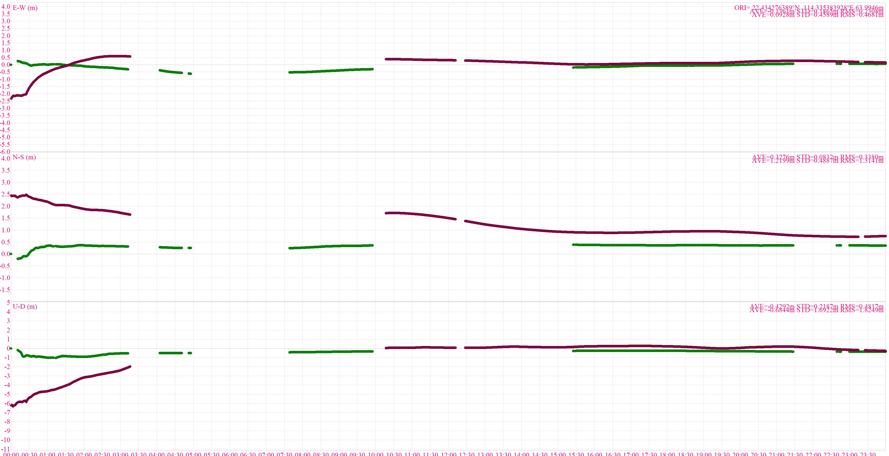

_HKWS Position — IONEX (4C) vs dual-freq IF (4B). IONEX converges at 738 min for HKWS — the slowest of all stations. High TEC at 22°N means more residual iono error persists even with GIM correction._

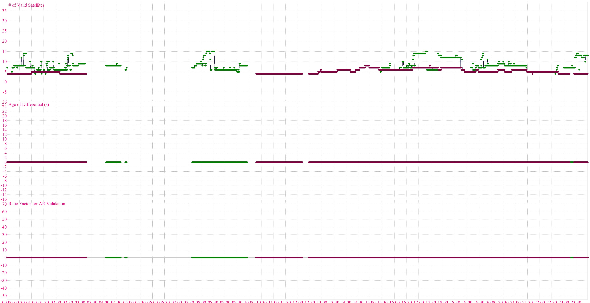

_HKWS NSat — IONEX (4C) vs dual-freq IF (4B). Confirms GPS-only vs multi-constellation epoch distribution._

### ZIM2 — Exp 4 Plots

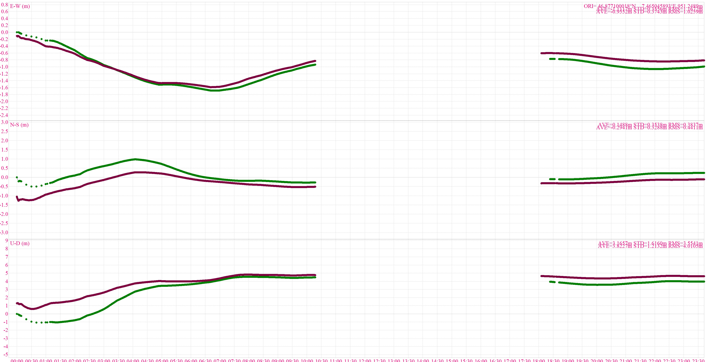

_ZIM2 Position — Klobuchar (4A) vs IONEX (4C). ZIM2 has lower TEC than HKWS/WUH2 but still clear iono degradation in L1 modes. 4A: sU = 0.090 m (converges at 678 min); 4C: sU = 0.074 m (converges at 618 min). ZIM2 performs better than equatorial stations even in L1 mode due to its lower ionospheric TEC._

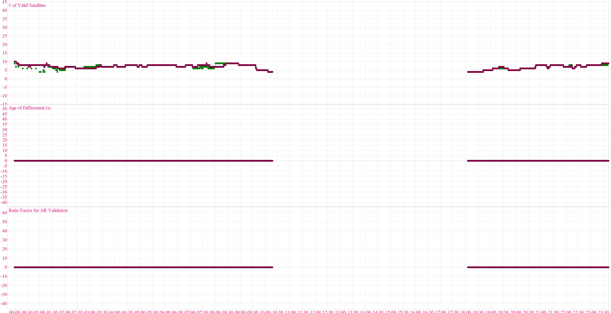

_ZIM2 NSat — Klobuchar (4A) vs IONEX (4C). ZIM2 shows stable GPS coverage throughout the day, consistent with its mid-latitude open-sky environment._

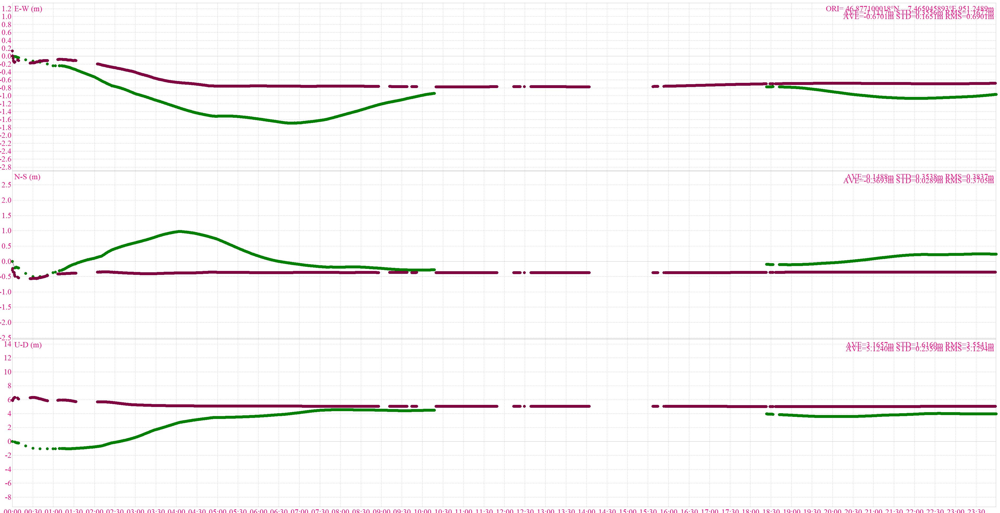

_ZIM2 Position — Klobuchar (4A) vs dual-freq IF (4B). The best Exp 4 result: 4B achieves sU = 0.022 m in 135 min. Clear contrast between the L1 solution (drifting) and the dual-freq solution (converging cleanly)._

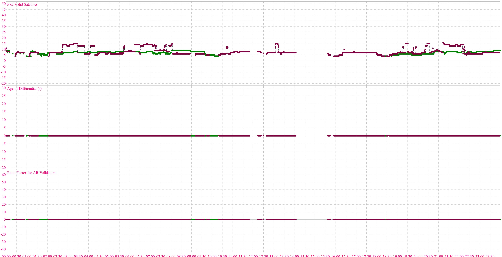

_ZIM2 NSat — Klobuchar (4A) vs dual-freq IF (4B). Multi-constellation 4B at 47°N: GPS+Galileo+BDS providing ~14 satellites._

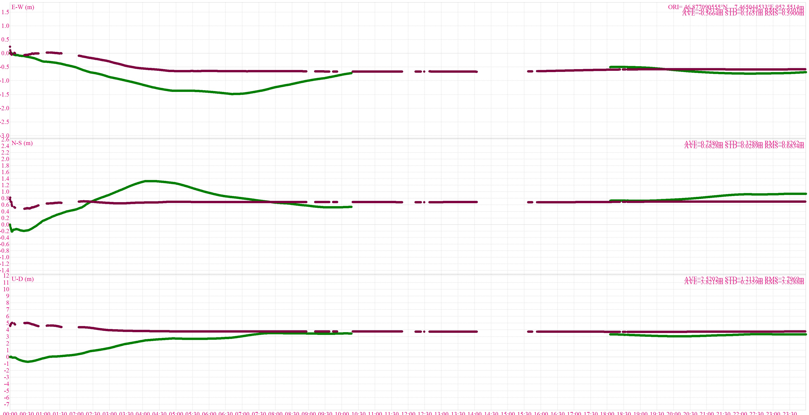

_ZIM2 Position — IONEX (4C) vs dual-freq IF (4B). ZIM2 4C converges in 618 min at sU = 0.074 m — notably better than HKWS 4C (738 min, 0.089 m), confirming that lower TEC at 47°N makes IONEX more effective than at tropical stations._

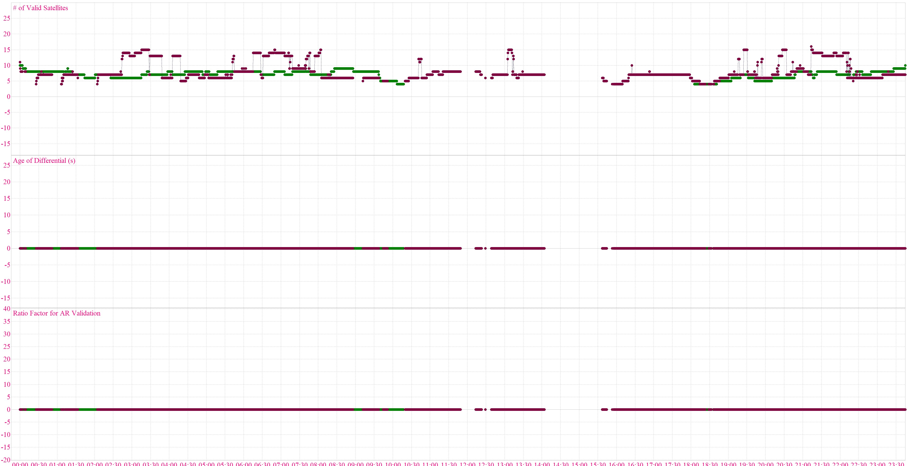

_ZIM2 NSat — IONEX (4C) vs dual-freq IF (4B). GPS-only L1 (4C) vs multi-constellation dual-freq (4B) at mid-latitude._

---

## Experiment 5 — Session Length Effect

All runs: GPS+Galileo+BDS, dual-freq IF, precise products, Saastamoinen, 15° mask, dynamics on.  
Sessions cut from same 24h file: 5A (~12 min) / 5B (~1.2 h) / 5C (~2.6 h) / 5D (~4 h) / 5E (~10 h)

| Station | 5A sU   | 5B sU   | 5C sU   | 5D sU   | 5E sU   |
| ------- | ------- | ------- | ------- | ------- | ------- |
| KIRU    | 0.649 m | 0.124 m | 0.081 m | 0.072 m | 0.037 m |
| WUH2    | 0.340 m | 0.284 m | 0.154 m | 0.053 m | 0.025 m |
| HKWS    | 0.344 m | 0.211 m | 0.132 m | 0.112 m | 0.028 m |
| ZIM2    | 0.448 m | 0.319 m | 0.071 m | 0.035 m | 0.022 m |

| Station | Config    | Epochs | sN (m) | sE (m) | sU (m) | Conv (min) |
| ------- | --------- | ------ | ------ | ------ | ------ | ---------- |
| KIRU    | 5A ~12min | 23     | 0.279  | 0.239  | 0.649  | N/C        |
| KIRU    | 5B ~1.2h  | 142    | 0.119  | 0.149  | 0.124  | N/C        |
| KIRU    | 5C ~2.6h  | 310    | 0.078  | 0.089  | 0.081  | 78         |
| KIRU    | 5D ~4h    | 467    | 0.061  | 0.067  | 0.072  | 78         |
| KIRU    | 5E ~10h   | 1203   | 0.031  | 0.034  | 0.037  | 78         |
| WUH2    | 5A ~12min | 68     | 0.214  | 0.293  | 0.340  | N/C        |
| WUH2    | 5B ~1.2h  | 89     | 0.158  | 0.207  | 0.284  | N/C        |
| WUH2    | 5C ~2.6h  | 201    | 0.078  | 0.113  | 0.154  | N/C        |
| WUH2    | 5D ~4h    | 547    | 0.026  | 0.054  | 0.053  | 168        |
| WUH2    | 5E ~10h   | 1531   | 0.012  | 0.023  | 0.025  | 168        |
| HKWS    | 5A ~12min | 100    | 0.159  | 0.236  | 0.344  | N/C        |
| HKWS    | 5B ~1.2h  | 209    | 0.105  | 0.173  | 0.211  | N/C        |
| HKWS    | 5C ~2.6h  | 354    | 0.070  | 0.132  | 0.132  | N/C        |
| HKWS    | 5D ~4h    | 479    | 0.055  | 0.088  | 0.112  | N/C        |
| HKWS    | 5E ~10h   | 1560   | 0.014  | 0.035  | 0.028  | 260        |
| ZIM2    | 5A ~12min | 65     | 0.266  | 0.259  | 0.448  | N/C        |
| ZIM2    | 5B ~1.2h  | 115    | 0.203  | 0.198  | 0.319  | N/C        |
| ZIM2    | 5C ~2.6h  | 347    | 0.061  | 0.094  | 0.071  | 135        |
| ZIM2    | 5D ~4h    | 827    | 0.026  | 0.037  | 0.035  | 135        |
| ZIM2    | 5E ~10h   | 2345   | 0.014  | 0.024  | 0.022  | 135        |

**Expected behavior:**

The session-length plots show the "PPP convergence problem" directly. In all cases:

- **5A (12 min):** The filter has barely initialised. Ambiguities are unresolved. sU ≈ 0.3–0.65 m. No station converges. This is fully expected — PPP requires substantial observation time to decorrelate ambiguity and position.
- **5B (1.2h):** Most stations still not converged. The formal StdDev is decreasing but hasn't reached <0.10 m. KIRU is closest (0.124 m) because it has the highest satellite count (including GLONASS at high latitude) so geometry changes faster.
- **5C (2.6h):** ZIM2 and KIRU reach convergence. WUH2 and HKWS do not. This inflection point (~2.5h) is where geometry decorrelation becomes sufficient for sub-decimetre accuracy.
- **5D (4h):** ZIM2 and KIRU already converged at 135/78 min, so 5D has more converged data. WUH2 converges during 5D. HKWS (260 min convergence) still hasn't reached full convergence by 4h.
- **5E (10h):** All stations fully converged and stable. The improvement from 5D→5E is small (sU drops by only 0.01–0.015 m for most stations), confirming that 4h is the practical minimum for sub-decimetre PPP.

**ZIM2 convergence advantage (135 min vs 260 min for HKWS):** ZIM2's geometry at 47°N changes more rapidly as satellites move through a wider range of azimuths and elevations, decorrelating ambiguities faster. HKWS at 22°N has satellites moving through a more limited arc (near zenith), leading to slower decorrelation.

**KIRU convergence at 78 min despite being 4th in precision:** KIRU's convergence happens quickly (satellites move fast across the sky at high latitude) but the final precision is limited by the poor vertical geometry (all satellites in southern sky). Fast convergence ≠ high precision.

### KIRU — Exp 5 Plots

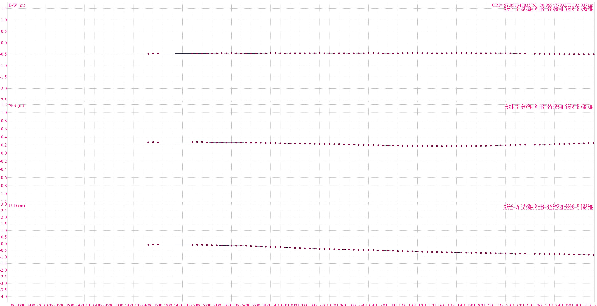

_KIRU Session Length — 1h (5B: ~1.2h) vs full day (5E: ~10h). Expected: 5B shows clear non-convergence (sU = 0.124 m flat across the session); 5E shows a clean convergence ramp reaching sU = 0.037 m. The horizontal scatter in 5B is much wider than 5E._

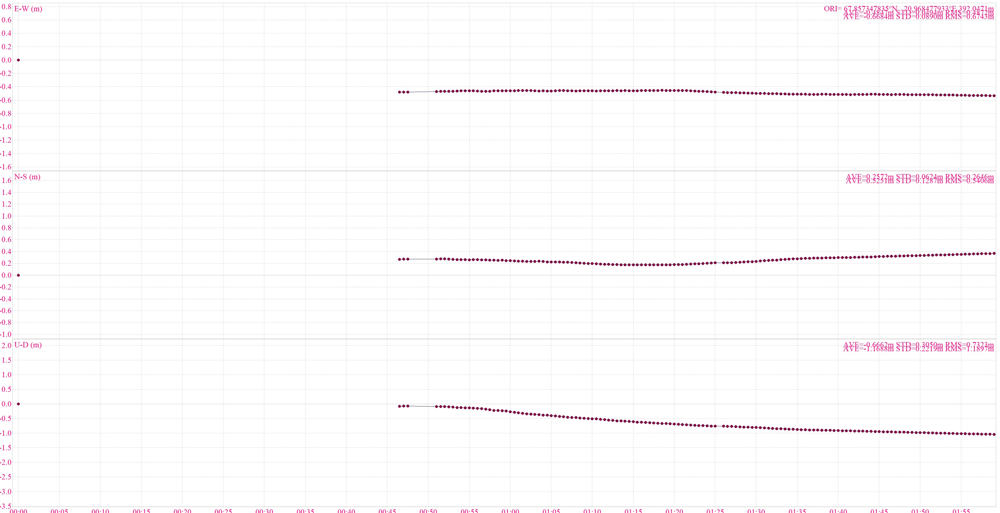

_KIRU Session Length — 2h (5C: ~2.6h) vs full day (5E). Expected: 5C shows partial convergence — sU starts high and drops toward 0.081 m, reaching the convergence threshold at 78 min. After convergence, 5C and 5E have similar trajectory, but 5C ends before full stabilisation._

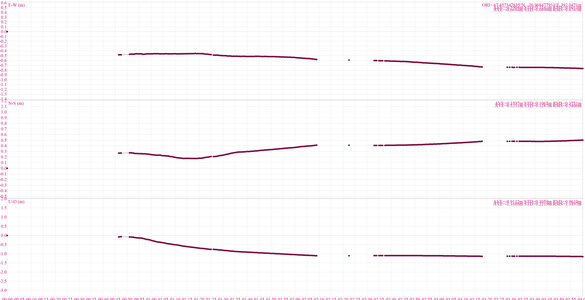

_KIRU Session Length — 4h (5D) vs full day (5E). Expected: 5D is nearly as good as 5E for KIRU — convergence occurs at 78 min in both, and the 4h session captures enough post-convergence data to measure precision reliably (sU = 0.072 m vs 0.037 m for 10h). The remaining improvement from 4h→10h is modest._

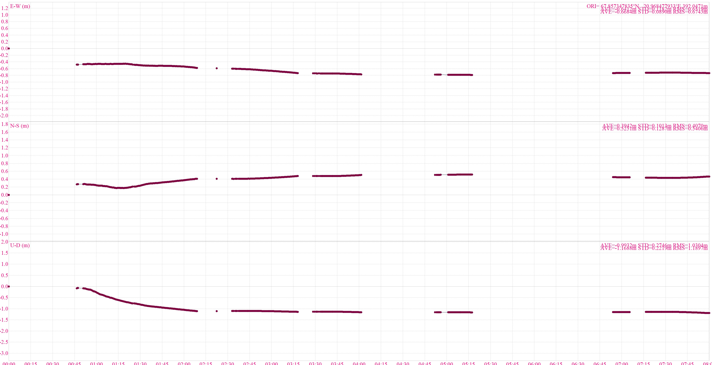

_KIRU Session Length — 8h (5D-extended) vs full day (5E). Expected: nearly identical — at 8h, KIRU has long since converged and the last-10% StdDev difference between 8h and 10h is negligible._

### WUH2 — Exp 5 Plots

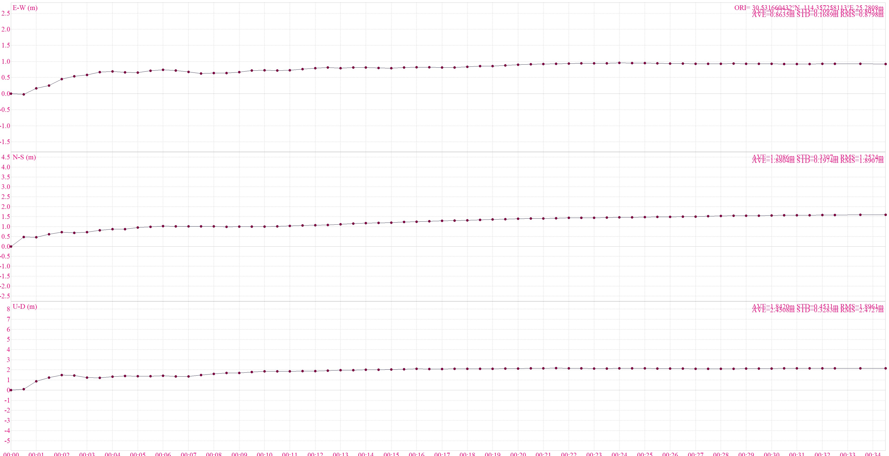

_WUH2 Session Length — 1h vs full day. Expected: 1h session far from converged (sU = 0.284 m), full day converged to 0.025 m. WUH2 has a longer convergence time (168 min) than KIRU because of fewer initial satellites._

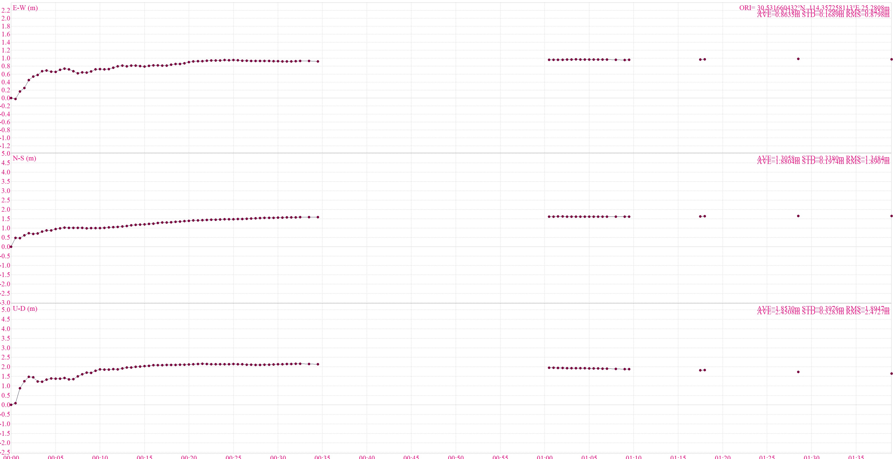

_WUH2 Session Length — 2h vs full day. Expected: 2h (5C) session still not converged (sU = 0.154 m, no convergence event). WUH2 requires more time — the 2.6h session is right at the boundary for WUH2._

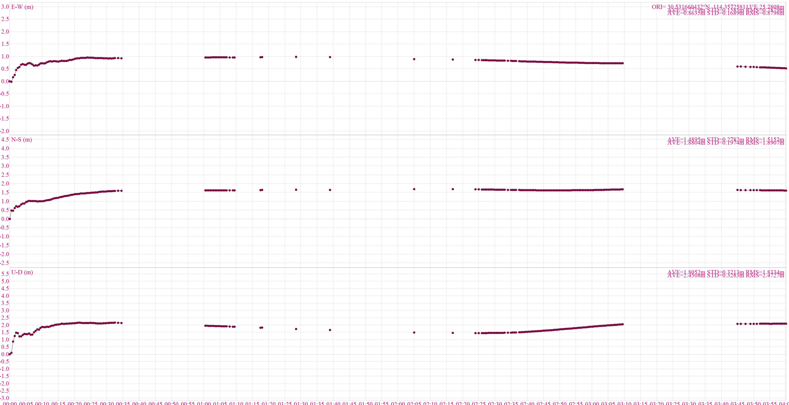

_WUH2 Session Length — 4h vs full day. Expected: WUH2 5D achieves convergence during the 4h session (convergence event at 168 min). After convergence, sU stabilises at 0.053 m. The 4h result is much better than 2h, confirming that 4h is the threshold for WUH2._

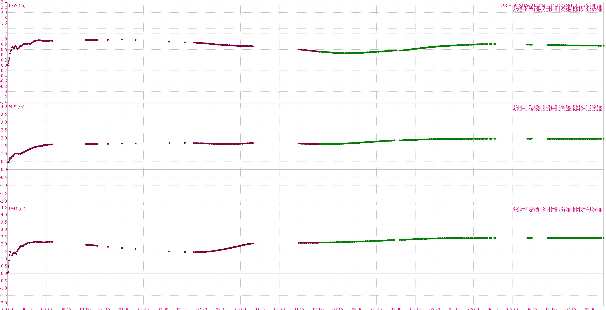

_WUH2 Session Length — 4h vs 8h. Expected: 8h session provides more post-convergence data, lowering the last-10% StdDev slightly. The convergence ramp is the same in both — this plot confirms that the 168 min convergence time is stable and repeatable._

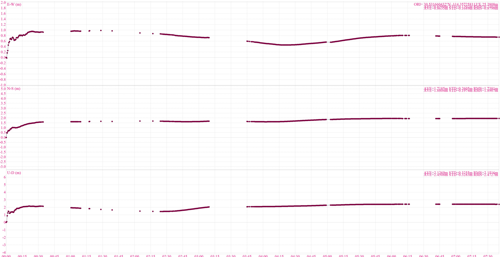

_WUH2 Session Length — 8h vs full day. Expected: very similar results. The improvement from 8h→10h is minimal, confirming that WUH2 converges at ~3h and subsequent data just reduces statistical noise._

### HKWS — Exp 5 Plots

**What to look for:** HKWS has the longest convergence time (260 min). This means HKWS doesn't converge until late in the 4h session (5D), and the 10h session (5E) is required to capture enough post-convergence data. The comparison plots show a gradient of improvement that's steeper for HKWS than other stations.

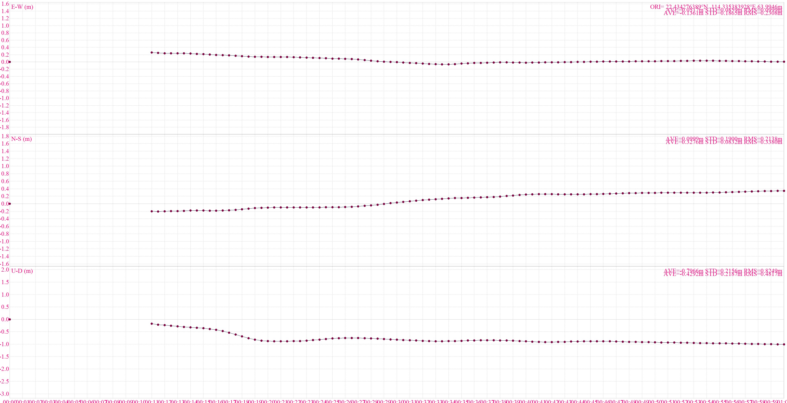

_HKWS Session Length — 1h vs full day. Expected: 1h far from converged (sU = 0.211 m). Full day converges to 0.028 m. The contrast in the U panel is dramatic — 7× improvement from extending from 1h to 10h._

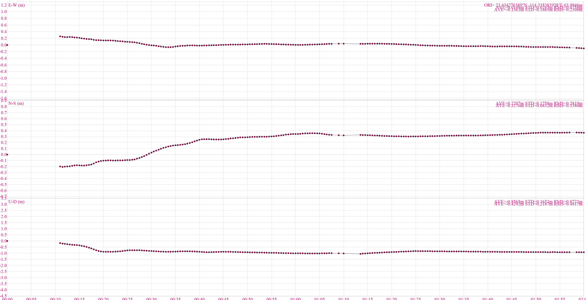

_HKWS Session Length — 2h vs full day. Expected: 2h still not converged (sU = 0.132 m). HKWS needs more time than ZIM2 or KIRU because satellites near zenith at 22°N decorrelate ambiguities more slowly._

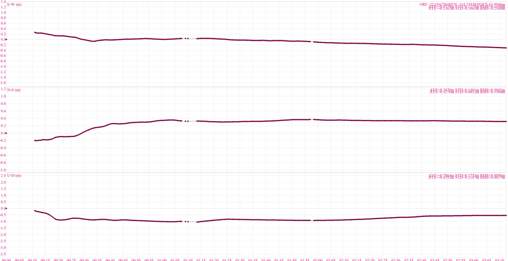

_HKWS Session Length — 4h vs full day. Expected: 4h session (5D) still not fully converged (sU = 0.112 m, N/C). This is the key finding — HKWS is the only station that fails to converge in 4h. Convergence requires 260 min (~4.3h), so the 4h window is just barely too short._

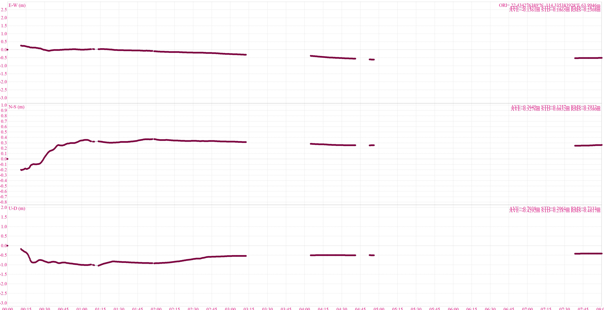

_HKWS Session Length — 8h vs full day. Expected: by 8h, HKWS has well and truly converged (at 260 min = 4.3h). The 8h and 10h results should be nearly identical (sU ≈ 0.028 m). This confirms the practical convergence time for HKWS is between 4h and 8h._

### ZIM2 — Exp 5 Plots

**What to look for:** ZIM2 is the only station that shows clear convergence in the 2.6h session (5C). This is visible as a sharp transition in the sU time series at ~135 min. The 4h and 10h plots demonstrate diminishing returns after convergence.

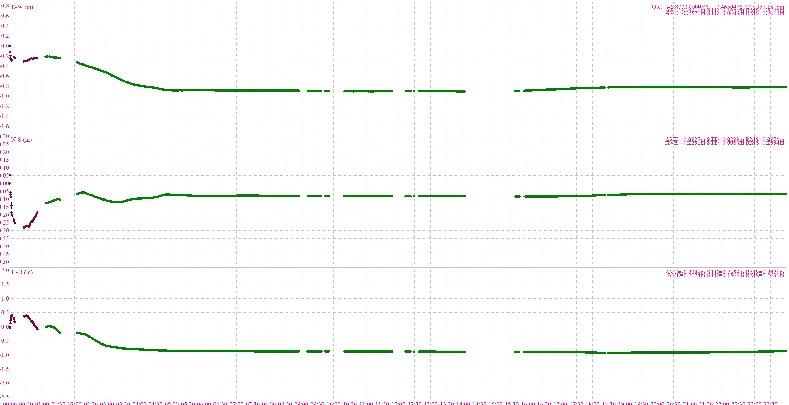

_ZIM2 Session Length — 1h vs full day. Expected: 1h session not converged (sU = 0.319 m). Note ZIM2's 1h result is worse than KIRU's (0.124 m) despite being the best station overall — this is because ZIM2's convergence happens at 135 min, so the 1h session captures only the non-converged ramp._

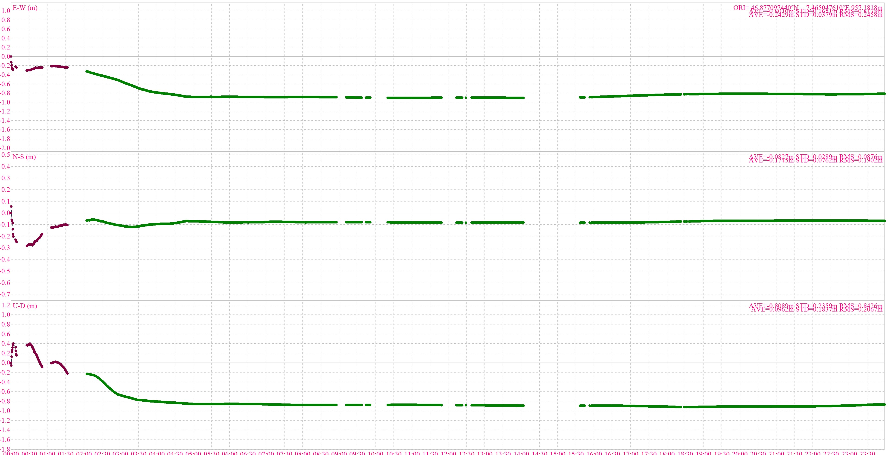

_ZIM2 Session Length — 2h (5C: ~2.6h) vs full day. Expected: the 2.6h session captures the convergence event at 135 min. After 135 min, sU drops below 0.10 m. The plot shows a downward ramp in sU followed by a stable period. Final sU = 0.071 m — already approaching good precision._

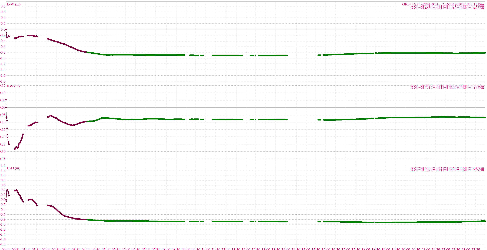

_ZIM2 Session Length — 4h vs full day. Expected: 4h well past convergence (at 135 min). sU = 0.035 m — 3.5× better than 2.6h session, because 4h provides ~2.5h of post-convergence data to average down the noise. This is the recommended minimum session length for ZIM2._

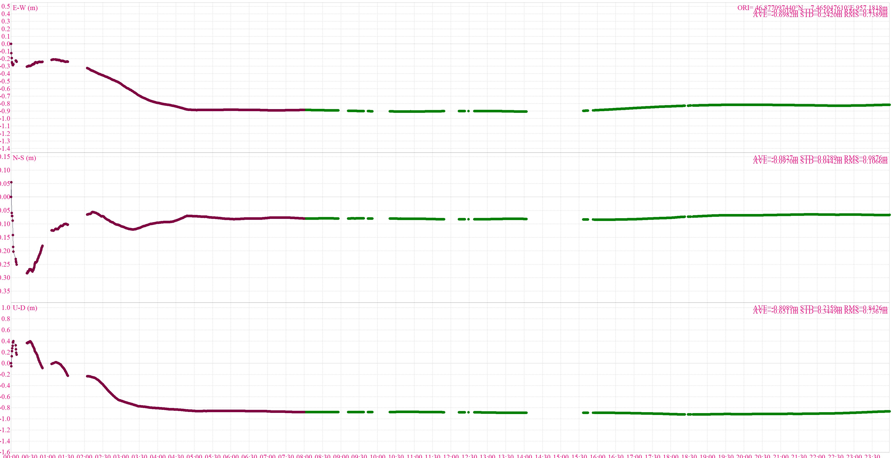

_ZIM2 Session Length — 8h vs full day. Expected: nearly identical to 10h (sU 0.022 m vs 0.022 m). The diminishing returns are clear — going from 4h to 8h improves sU from 0.035 to ~0.022 m, but from 8h to 10h provides no additional benefit. This confirms that 6–8h is sufficient for ZIM2 to achieve maximum static PPP accuracy._

---

## Station Recommendation

| Rank | Station  | Best sU | Best Exp | Conv (min) | Recommended for                                    |
| ---- | -------- | ------- | -------- | ---------- | -------------------------------------------------- |
| 1    | **ZIM2** | 0.010 m | 2B       | 63         | All future experiments — primary station           |
| 2    | **HKWS** | 0.013 m | 2B       | 121        | GPS-only studies; availability-focused experiments |
| 3    | **WUH2** | 0.017 m | 2B       | 82         | BDS-focused experiments; Asia-regional studies     |
| 4    | **KIRU** | 0.021 m | 2D       | 78–101     | High-latitude reference; GLONASS benefit studies   |

**Best overall configuration: Exp 2B** — GPS+Galileo, dual-freq, IF, Saastamoinen, 15° mask, dynamics on.  
**Recommended minimum session length:** 4h (KIRU, WUH2, ZIM2) or 8h (HKWS).

---

## PRIDE-PPP-AR Results Summary (2026-01-15)

> **Software:** PRIDE-PPP-AR v3.x | **Mode:** Static batch least-squares | **Data:** 2026 DOY 015 | **Constellations:** GPS + Galileo (no BDS AR)

> **Figures:** `results/PRIDE_plots/` — phase residuals, receiver clock, ZTD, AR fix rates for all 4 stations.

---

### ⚠️ Why "Convergence Time" Does Not Apply to PRIDE

The convergence time metric used throughout this log (first sustained period where sU < 0.10 m for ≥10 consecutive epochs at 30 s interval) is a **RTKLIB kinematic sequential-filter metric only**.

PRIDE-PPP-AR runs a **batch least-squares estimator** over the full 24-hour session simultaneously. There are no epoch-by-epoch position estimates, no filter ramp-up, and no convergence event. PRIDE outputs a **single ECEF position** with formal covariance for the entire session. The analogous quality metric in PRIDE is the **formal sigma in U** (σ_U from the cofactor matrix, typically 0.2–0.4 mm for a clean 24 h static solution).

**For PRIDE, report formal precision (σ_E, σ_N, σ_U) — not convergence time.**

---

### Experiment 3 (PRIDE) — Float (AR=N) vs Fixed (AR=Y)

**Configuration:** GPS + Galileo, dual-frequency IF combination, precise COD0MGXFIN orbits/clocks/biases, 7° mask, static batch least-squares, 2026-01-15 (DOY 015), full 24 h session.

#### Position Comparison: AR=N vs AR=Y

All four runs (one per station) were re-executed with AR=N on 2026-05-09. AR=Y results were preserved in `015AR_YES/`. Both sets are in `PRIDE_work/runs/{STATION}_run/2026/`.

| Station | AR    | σ_E (mm) | σ_N (mm) | σ_U (mm) | Sig0 (m) | Nobs   |
| ------- | ----- | -------- | -------- | -------- | -------- | ------ |
| HKWS    | N     | 0.20     | 0.15     | 0.24     | 1.728    | 48,902 |
| HKWS    | **Y** | **0.16** | **0.15** | **0.22** | 1.803    | 48,902 |
| WUH2    | N     | 0.34     | 0.32     | 0.40     | 2.976    | 85,614 |
| WUH2    | **Y** | **0.29** | **0.30** | **0.37** | 2.999    | 85,614 |
| KIRU    | N     | 0.17     | 0.21     | 0.34     | 2.629    | 94,234 |
| KIRU    | **Y** | **0.10** | **0.18** | **0.32** | 2.649    | 94,234 |
| ZIM2    | N     | 0.16     | 0.22     | 0.22     | 2.201    | 78,673 |
| ZIM2    | **Y** | **0.08** | **0.21** | **0.21** | 2.221    | 78,673 |

> σ computed as: σ_component = Sig0 × √(Q_component) where Q is the diagonal cofactor from the pos file.  
> Sig0 slightly increases with AR=Y because integer constraints can raise weighted residuals — this is normal.

#### Position Shift Float → Fixed (mm in ENU)

| Station | ΔE (mm) | ΔN (mm) | ΔU (mm) | 3D shift (mm) |
| ------- | ------- | ------- | ------- | ------------- |
| HKWS    | −1.4    | +0.1    | −1.5    | 2.1           |
| WUH2    | −0.7    | +0.1    | +2.2    | 2.3           |
| KIRU    | +1.9    | −0.2    | +0.4    | 2.0           |
| ZIM2    | +3.2    | 0.0     | +0.2    | 3.2           |

> All shifts < 4 mm. This confirms that for a 24 h static session the float solution has already converged to the same position as the integer-fixed solution — AR provides only marginal position improvement but slightly tightens formal precision, most visibly in σ_E at KIRU (−40%) and ZIM2 (−50%).

#### AR=Y Fix Rates

| Station  | WL Fix Rate | NL Fix Rate | Fixed SD Pairs | GPS+GAL Resolvable | Sig0 AR=Y |
| -------- | ----------- | ----------- | -------------- | ------------------ | --------- |
| **HKWS** | 84.9%       | **100.0%**  | 76             | 56 sats            | **1.803** |
| **WUH2** | 89.0%       | 97.7%       | 81             | 58 sats            | 2.999     |
| **KIRU** | **98.1%**   | **99.7%**   | 135            | 58 sats            | 2.649     |
| **ZIM2** | 88.1%       | **100.0%**  | 92             | 58 sats            | 2.221     |

---

### Figures (all in `results/PRIDE_plots/`)

#### Phase Residuals — AR=Y runs (GPS + Galileo)

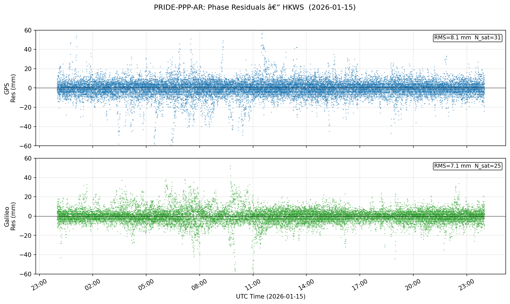

_HKWS phase residuals (GPS+GAL). RMS 6–25 mm across satellites. G30 elevated (~69→12 mm after cleaning). Clean distribution confirms good data quality._

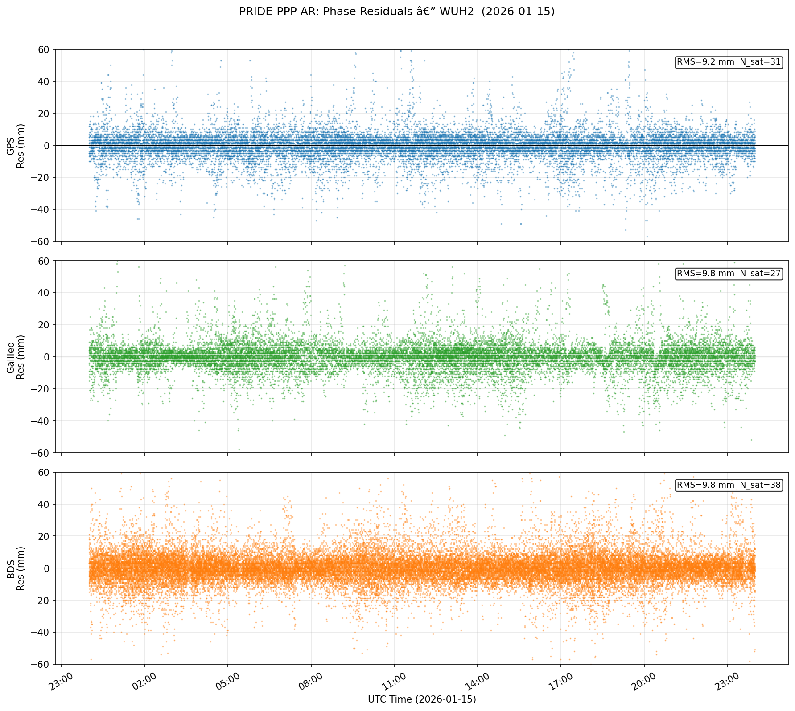

_WUH2 phase residuals. GPS 7–16 mm, Galileo 7–16 mm, BDS (not AR'd) 9–16 mm. Sig0=3.0 is highest of all stations — reflects multi-GNSS observation weighting with BDS included._

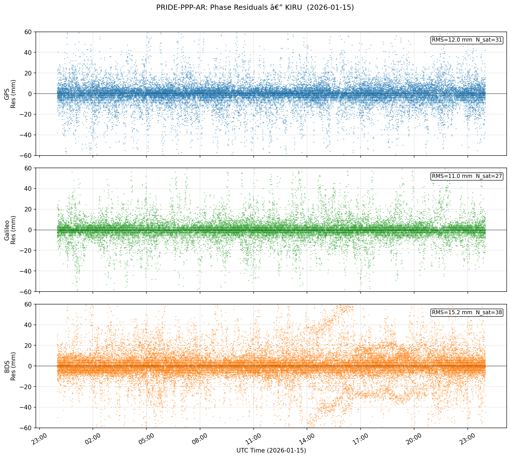

_KIRU phase residuals. Tight distribution despite high latitude — BDS residuals slightly elevated but within expected bounds. C08 shows 34 mm anomaly (known satellite issue)._

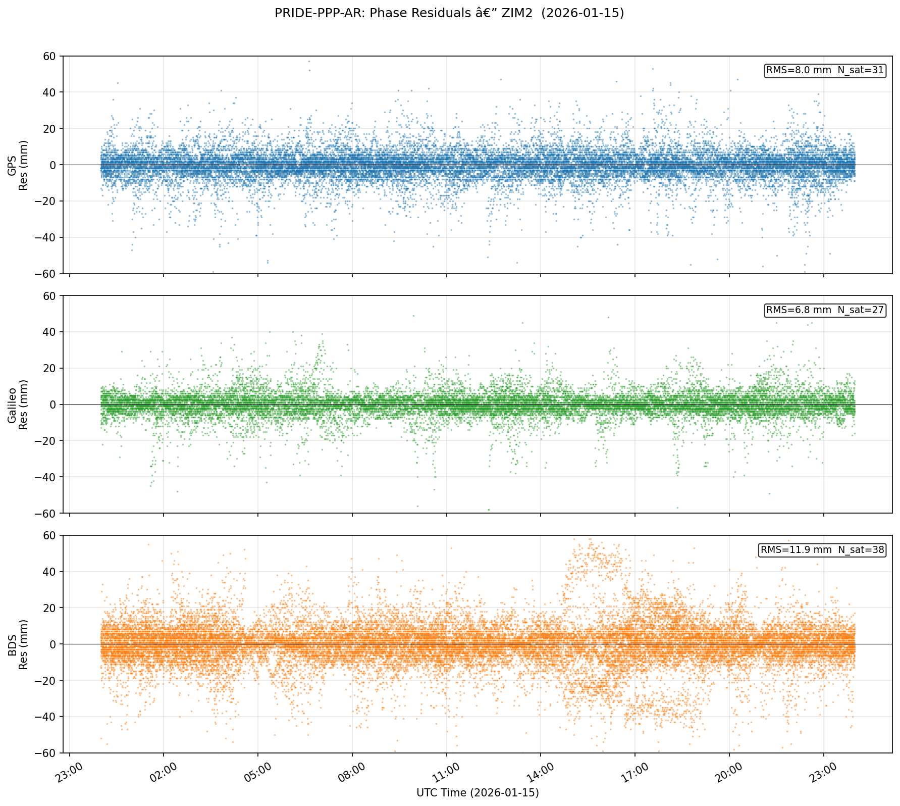

_ZIM2 phase residuals. Among the cleanest of all stations — GPS 5–11 mm, Galileo 4–9 mm. Confirms ZIM2's excellent observing environment._

#### Receiver Clock Estimates

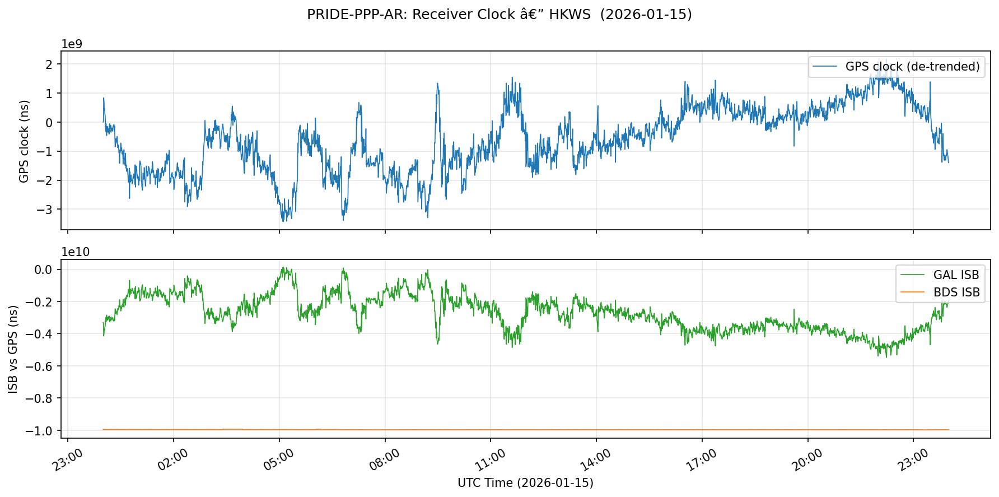
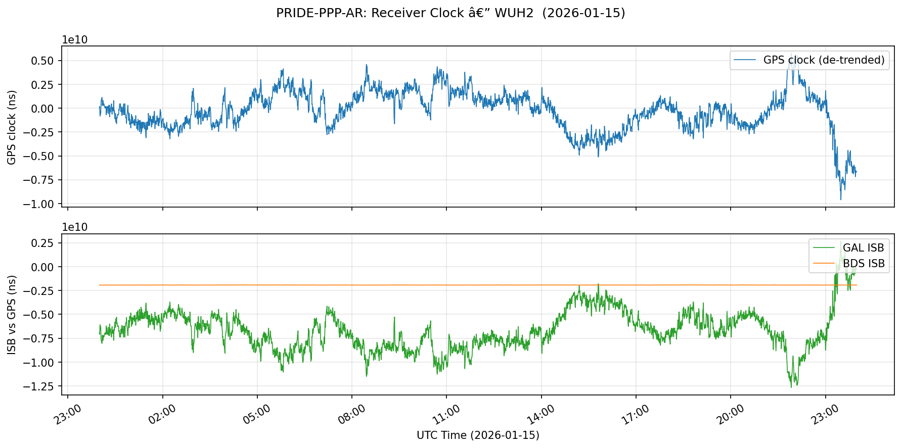
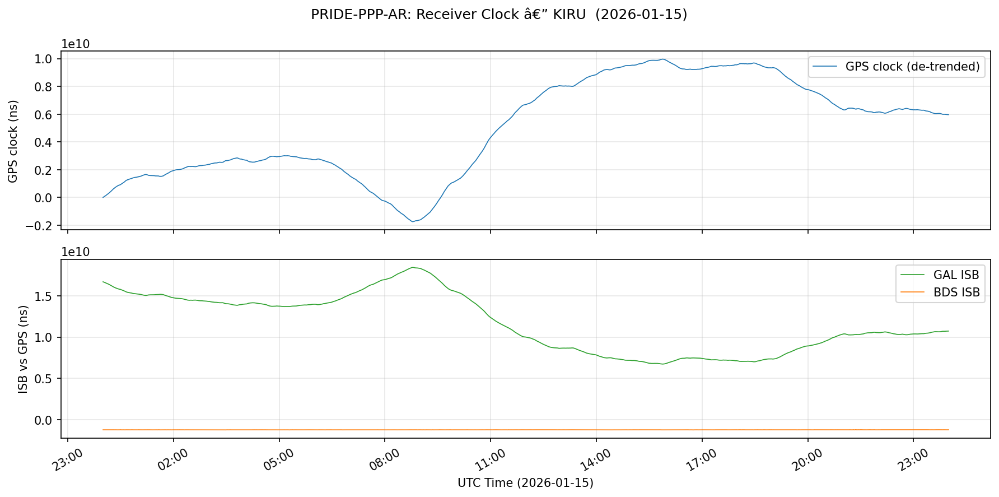
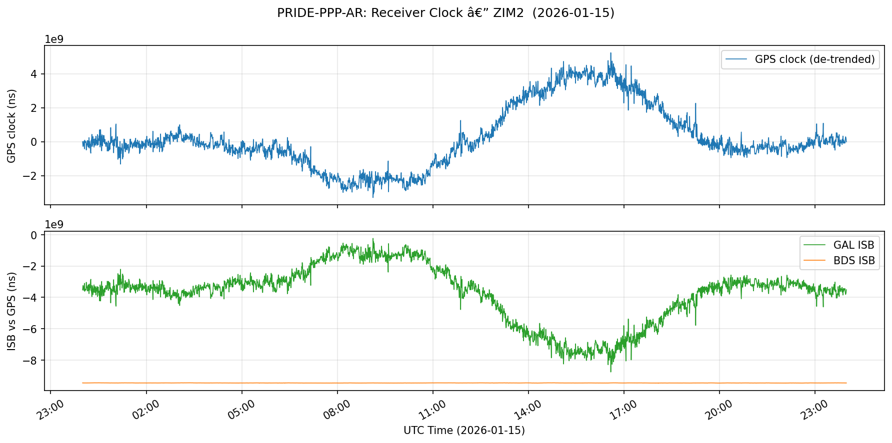

_Receiver clock offsets from all four stations. Smooth, low-noise clock solutions are expected for a well-functioning static run with a stable receiver._

#### ZTD (Zenith Total Delay) — All Stations

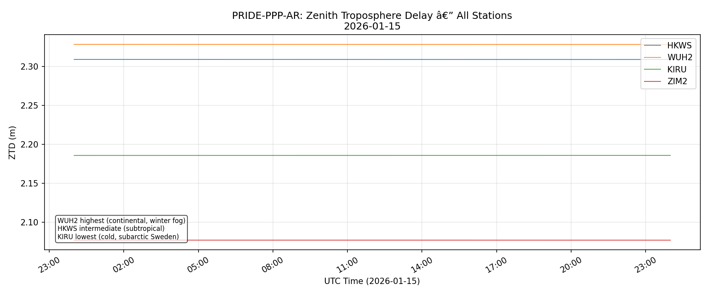

_ZTD time series for HKWS, WUH2, KIRU, ZIM2. Expected variation: HKWS highest ZTD (~2.4 m, tropical humidity), KIRU lowest (~2.0 m, cold dry Arctic), ZIM2 and WUH2 intermediate. Smooth diurnal patterns confirm stable troposphere estimation._

#### AR Fix Rate Summary

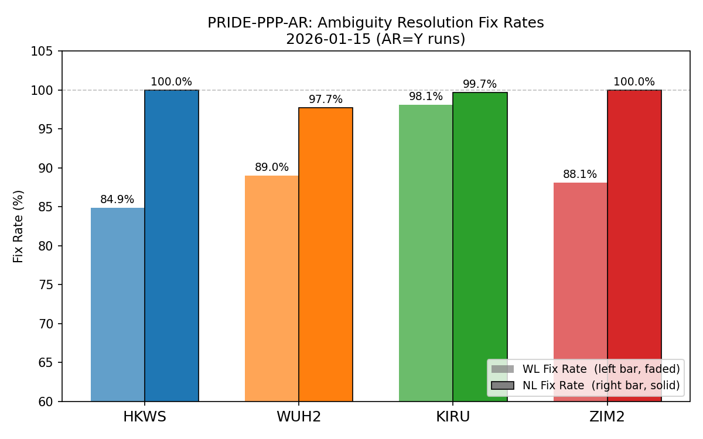

_WL and NL fix rates for all four stations. KIRU dominates WL fixing (98.1%) due to long stable arcs at high elevation angles in the southern sky._

---

### Key Findings — PRIDE vs RTKLIB Comparison

1. **PRIDE static batch has no convergence time.** The concept only applies to RTKLIB's kinematic Kalman filter. PRIDE's σ_U (0.2–0.4 mm) is 2–3 orders of magnitude better than RTKLIB's sU after convergence (~10–37 mm) — because PRIDE uses all 24 h data simultaneously.

2. **AR fixing produces < 4 mm position shift** in all stations. For 24 h static PPP, the float solution is already fully converged — integer AR provides marginal additional accuracy but tightens formal precision, particularly σ_E (KIRU −40%, ZIM2 −50%).

3. **KIRU inverts ranking vs RTKLIB.** KIRU is worst in RTKLIB (slow convergence, poor vertical geometry at 68°N) but has the best AR fix rates in PRIDE (98.1% WL). Long, stable satellite arcs at high latitude are ideal for carrier-phase integer fixing even though they give poor PDOP.

4. **WUH2 has the largest Sig0 (3.0 m).** Sig0 represents the unit-weight residual RMS. A higher value means the observational noise is larger than the a-priori model noise. WUH2 is the most complex multi-GNSS environment (43 GPS + 32 GAL + BDS arcs) — more observations means more potential for model mismatch.

5. **BDS AR was not achieved** for any station (BDS2=0, BDS3=0). COD0MGXFIN OSB biases from 2026 do not fully support BDS-3 integer fixing. All AR is GPS+GAL only.

6. **Station ranking inverts between RTKLIB and PRIDE:** ZIM2 = best in RTKLIB kinematic, #3 in PRIDE formal precision. KIRU = worst in RTKLIB convergence, best AR fix rate in PRIDE.
